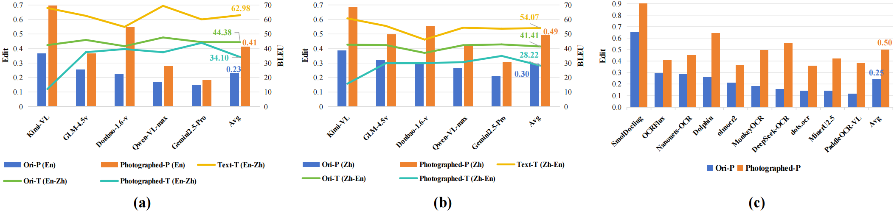

<div align="center">

<h1> DocPTBench: Benchmarking End-to-End Photographed Document Parsing and Translation </h1>

<h5 align="center"> If you find this project useful, please give us a star🌟. </h5>

<a href="https://github.com/Topdu/DocPTBench/blob/main/LICENSE"></a>
<a href='https://www.arxiv.org/abs/2511.18434'></a>
<a href="https://huggingface.co/datasets/topdu/DocPTBench" target="_blank"></a>
<a href="https://modelscope.cn/datasets/topdktu/DocPTBench" target="_blank"></a>

</div>


DocPTBench is **a benchmark designed specifically for real-world photographed documents**, targeting both **document parsing** and **document translation** in challenging, realistic environments.

Unlike previous benchmarks built on clean-born digital documents, DocPTBench exposes models to:

* perspective distortion
* lighting variations / shadows
* motion blur
* physical folds & wrinkles
* noise and camera artifacts

This benchmark enables rigorous evaluation of both **Document Parsing models** and **Multimodal LLMs (MLLMs)** under practical conditions.

## 📈 Highlights from the Paper

<p align="center">
  
  
  (a): the results of MLLMs on English (En)-started parsing (P) and translation (T) tasks; (b): the counterpart on Chinese (Zh)-started tasks; (c): the results from document parsing expert models. Ori- refers to the original digital-born document and Photographed-is its photographed version. Text- indicates that only the textual content of the document image is used as the source-language input. Alower Edit distance indicates higher parsing quality, and a higher BLEU score reflects better translation fidelity.
</p>

- 📉 **MLLMs an average parsing drops by 18%** on photographed docs
- 📉 **Expert models drop 25%**
- 📉 **Translation BLEU drops by 12%**
- 🔧 **Unwarping helps**, but does not fully restore original quality
- 💡 **CoT prompting greatly reduces instruction-following failures**

---

## 🌟 Key Features

### 📷 1,381 Realistic Photographed Documents

Including both **simulated** and **real-camera** captures.

### 🌐 8 Language Pairs for Translation

**En ↔ Zh / De / Fr / Ru** and **Zh ↔ En / De / Fr / Ru**, all **human-verified**.

### 🖼 Three Document Conditions

```
Digital-Born (Original) → Photographed → Unwarping
```
<p align="center">
  
</p>

### 🎯 End-to-End Evaluation

Supports both:

* Parsing-only models
* Unified end-to-end MLLMs

---

## 🏆 Document Parsing LeaderBoard


<table style="width:100%; border-collapse:collapse; font-size:10px; margin:10px 0; font-family: Arial, sans-serif;">
<thead>
    <tr>
        <th rowspan="2" style="border:1px solid #000; padding:4px; text-align:center; vertical-align:middle; font-weight:bold;">Type</th>
        <th rowspan="2" style="border:1px solid #000; padding:4px; text-align:center; vertical-align:middle; font-weight:bold;">Model</th>
        <th rowspan="2" style="border:1px solid #000; padding:4px; text-align:center; vertical-align:middle; font-weight:bold;">Scene</th>
        <th colspan="2" style="border:1px solid #000; padding:4px; text-align:center; vertical-align:middle; font-weight:bold;">Overall<sup>Edit↓</sup></th>
        <th colspan="2" style="border:1px solid #000; padding:4px; text-align:center; vertical-align:middle; font-weight:bold;">Text<sup>Edit↓</sup></th>
        <th colspan="2" style="border:1px solid #000; padding:4px; text-align:center; vertical-align:middle; font-weight:bold;">Formula<sup>Edit↓</sup></th>
        <th colspan="2" style="border:1px solid #000; padding:4px; text-align:center; vertical-align:middle; font-weight:bold;">Table<sup>TEDS↑</sup></th>
        <th colspan="2" style="border:1px solid #000; padding:4px; text-align:center; vertical-align:middle; font-weight:bold;">Table<sup>Edit↓</sup></th>
        <th colspan="2" style="border:1px solid #000; padding:4px; text-align:center; vertical-align:middle; font-weight:bold;">Reading Order<sup>Edit↓</sup></th>
    </tr>
    <tr>
        <th style="border:1px solid #000; padding:2px; text-align:center; font-weight:bold;">En</th>
        <th style="border:1px solid #000; padding:2px; text-align:center; font-weight:bold;">Zh</th>
        <th style="border:1px solid #000; padding:2px; text-align:center; font-weight:bold;">En</th>
        <th style="border:1px solid #000; padding:2px; text-align:center; font-weight:bold;">Zh</th>
        <th style="border:1px solid #000; padding:2px; text-align:center; font-weight:bold;">En</th>
        <th style="border:1px solid #000; padding:2px; text-align:center; font-weight:bold;">Zh</th>
        <th style="border:1px solid #000; padding:2px; text-align:center; font-weight:bold;">En</th>
        <th style="border:1px solid #000; padding:2px; text-align:center; font-weight:bold;">Zh</th>
        <th style="border:1px solid #000; padding:2px; text-align:center; font-weight:bold;">En</th>
        <th style="border:1px solid #000; padding:2px; text-align:center; font-weight:bold;">Zh</th>
        <th style="border:1px solid #000; padding:2px; text-align:center; font-weight:bold;">En</th>
        <th style="border:1px solid #000; padding:2px; text-align:center; font-weight:bold;">Zh</th>
    </tr>
</thead>
<tbody>
<tr>
<td rowspan="36" style="border:1px solid #000; padding:2px; text-align:center; font-weight:bold;"><b>Expert Models</b></td>
<!-- <td rowspan="36" style="border:1px solid #000; padding:2px; text-align:center; vertical-align:middle;writing-mode:vertical-rl; transform:rotate(180deg); width:30px;"><b>Expert Models</b></td> -->
<td rowspan="3" style="border:1px solid #000; padding:2px; text-align:center; vertical-align:middle;">PaddleOCR-VL</td>
<td style="border:1px solid #000; padding:2px; text-align:center; font-weight:bold;">Original</td>
<td style="border:1px solid #000; padding:2px; text-align:left; padding-left:5px;">10.5</td>
<td style="border:1px solid #000; padding:2px; text-align:left; padding-left:5px;">12.6</td>
<td style="border:1px solid #000; padding:2px; text-align:left; padding-left:5px;">4.1</td>
<td style="border:1px solid #000; padding:2px; text-align:left; padding-left:5px;">6.2</td>
<td style="border:1px solid #000; padding:2px; text-align:left; padding-left:5px;">24.1</td>
<td style="border:1px solid #000; padding:2px; text-align:left; padding-left:5px;">31.6</td>
<td style="border:1px solid #000; padding:2px; text-align:left; padding-left:5px;">88.0</td>
<td style="border:1px solid #000; padding:2px; text-align:left; padding-left:5px;">92.1</td>
<td style="border:1px solid #000; padding:2px; text-align:left; padding-left:5px;">9.3</td>
<td style="border:1px solid #000; padding:2px; text-align:left; padding-left:5px;">6.2</td>
<td style="border:1px solid #000; padding:2px; text-align:left; padding-left:5px;">4.5</td>
<td style="border:1px solid #000; padding:2px; text-align:left; padding-left:5px;">6.3</td>
</tr>
<tr>
<td style="border:1px solid #000; padding:2px; text-align:center; font-weight:bold;">Photographed</td>
<td style="border:1px solid #000; padding:2px; text-align:left; padding-left:5px;">37.5<sub style="color:red; font-size:0.8em;">↓27.0</sub></td>
<td style="border:1px solid #000; padding:2px; text-align:left; padding-left:5px;">39.6<sub style="color:red; font-size:0.8em;">↓27.0</sub></td>
<td style="border:1px solid #000; padding:2px; text-align:left; padding-left:5px;">29.4<sub style="color:red; font-size:0.8em;">↓25.3</sub></td>
<td style="border:1px solid #000; padding:2px; text-align:left; padding-left:5px;">37.7<sub style="color:red; font-size:0.8em;">↓31.5</sub></td>
<td style="border:1px solid #000; padding:2px; text-align:left; padding-left:5px;">46.5<sub style="color:red; font-size:0.8em;">↓22.4</sub></td>
<td style="border:1px solid #000; padding:2px; text-align:left; padding-left:5px;">52.6<sub style="color:red; font-size:0.8em;">↓21.0</sub></td>
<td style="border:1px solid #000; padding:2px; text-align:left; padding-left:5px;">54.2<sub style="color:red; font-size:0.8em;">↓33.8</sub></td>
<td style="border:1px solid #000; padding:2px; text-align:left; padding-left:5px;">65.3<sub style="color:red; font-size:0.8em;">↓26.8</sub></td>
<td style="border:1px solid #000; padding:2px; text-align:left; padding-left:5px;">44.4<sub style="color:red; font-size:0.8em;">↓35.1</sub></td>
<td style="border:1px solid #000; padding:2px; text-align:left; padding-left:5px;">31.4<sub style="color:red; font-size:0.8em;">↓25.2</sub></td>
<td style="border:1px solid #000; padding:2px; text-align:left; padding-left:5px;">28.8<sub style="color:red; font-size:0.8em;">↓24.3</sub></td>
<td style="border:1px solid #000; padding:2px; text-align:left; padding-left:5px;">37.9<sub style="color:red; font-size:0.8em;">↓31.6</sub></td>
</tr>
<tr>
<td style="border:1px solid #000; padding:2px; text-align:center; font-weight:bold;">Unwarping</td>
<td style="border:1px solid #000; padding:2px; text-align:left; padding-left:5px;">15.7<sub style="color:green; font-size:0.8em;">↑21.8</sub></td>
<td style="border:1px solid #000; padding:2px; text-align:left; padding-left:5px;">22.0<sub style="color:green; font-size:0.8em;">↑17.6</sub></td>
<td style="border:1px solid #000; padding:2px; text-align:left; padding-left:5px;">9.4<sub style="color:green; font-size:0.8em;">↑20.0</sub></td>
<td style="border:1px solid #000; padding:2px; text-align:left; padding-left:5px;">17.6<sub style="color:green; font-size:0.8em;">↑20.1</sub></td>
<td style="border:1px solid #000; padding:2px; text-align:left; padding-left:5px;">30.8<sub style="color:green; font-size:0.8em;">↑15.7</sub></td>
<td style="border:1px solid #000; padding:2px; text-align:left; padding-left:5px;">41.5<sub style="color:green; font-size:0.8em;">↑11.1</sub></td>
<td style="border:1px solid #000; padding:2px; text-align:left; padding-left:5px;">82.9<sub style="color:green; font-size:0.8em;">↑28.7</sub></td>
<td style="border:1px solid #000; padding:2px; text-align:left; padding-left:5px;">83.2<sub style="color:green; font-size:0.8em;">↑17.9</sub></td>
<td style="border:1px solid #000; padding:2px; text-align:left; padding-left:5px;">13.9<sub style="color:green; font-size:0.8em;">↑30.5</sub></td>
<td style="border:1px solid #000; padding:2px; text-align:left; padding-left:5px;">13.5<sub style="color:green; font-size:0.8em;">↑17.9</sub></td>
<td style="border:1px solid #000; padding:2px; text-align:left; padding-left:5px;">8.7<sub style="color:green; font-size:0.8em;">↑20.1</sub></td>
<td style="border:1px solid #000; padding:2px; text-align:left; padding-left:5px;">15.4<sub style="color:green; font-size:0.8em;">↑22.5</sub></td>
</tr>
<tr>
<td rowspan="3" style="border:1px solid #000; padding:2px; text-align:center; vertical-align:middle;">MinerU2.5</td>
<td style="border:1px solid #000; padding:2px; text-align:center; font-weight:bold;">Original</td>
<td style="border:1px solid #000; padding:2px; text-align:left; padding-left:5px;">11.1</td>
<td style="border:1px solid #000; padding:2px; text-align:left; padding-left:5px;">17.4</td>
<td style="border:1px solid #000; padding:2px; text-align:left; padding-left:5px;">5.0</td>
<td style="border:1px solid #000; padding:2px; text-align:left; padding-left:5px;">7.4</td>
<td style="border:1px solid #000; padding:2px; text-align:left; padding-left:5px;">25.8</td>
<td style="border:1px solid #000; padding:2px; text-align:left; padding-left:5px;">47.3</td>
<td style="border:1px solid #000; padding:2px; text-align:left; padding-left:5px;">88.3</td>
<td style="border:1px solid #000; padding:2px; text-align:left; padding-left:5px;">89.2</td>
<td style="border:1px solid #000; padding:2px; text-align:left; padding-left:5px;">8.9</td>
<td style="border:1px solid #000; padding:2px; text-align:left; padding-left:5px;">8.3</td>
<td style="border:1px solid #000; padding:2px; text-align:left; padding-left:5px;">4.5</td>
<td style="border:1px solid #000; padding:2px; text-align:left; padding-left:5px;">6.8</td>
</tr>
<tr>
<td style="border:1px solid #000; padding:2px; text-align:center; font-weight:bold;">Photographed</td>
<td style="border:1px solid #000; padding:2px; text-align:left; padding-left:5px;">37.3<sub style="color:red; font-size:0.8em;">↓26.2</sub></td>
<td style="border:1px solid #000; padding:2px; text-align:left; padding-left:5px;">47.4<sub style="color:red; font-size:0.8em;">↓30.0</sub></td>
<td style="border:1px solid #000; padding:2px; text-align:left; padding-left:5px;">37.0<sub style="color:red; font-size:0.8em;">↓32.0</sub></td>
<td style="border:1px solid #000; padding:2px; text-align:left; padding-left:5px;">53.6<sub style="color:red; font-size:0.8em;">↓46.2</sub></td>
<td style="border:1px solid #000; padding:2px; text-align:left; padding-left:5px;">44.3<sub style="color:red; font-size:0.8em;">↓18.5</sub></td>
<td style="border:1px solid #000; padding:2px; text-align:left; padding-left:5px;">62.0<sub style="color:red; font-size:0.8em;">↓14.7</sub></td>
<td style="border:1px solid #000; padding:2px; text-align:left; padding-left:5px;">54.9<sub style="color:red; font-size:0.8em;">↓33.4</sub></td>
<td style="border:1px solid #000; padding:2px; text-align:left; padding-left:5px;">59.8<sub style="color:red; font-size:0.8em;">↓29.4</sub></td>
<td style="border:1px solid #000; padding:2px; text-align:left; padding-left:5px;">38.9<sub style="color:red; font-size:0.8em;">↓30.0</sub></td>
<td style="border:1px solid #000; padding:2px; text-align:left; padding-left:5px;">33.5<sub style="color:red; font-size:0.8em;">↓25.2</sub></td>
<td style="border:1px solid #000; padding:2px; text-align:left; padding-left:5px;">29.0<sub style="color:red; font-size:0.8em;">↓24.5</sub></td>
<td style="border:1px solid #000; padding:2px; text-align:left; padding-left:5px;">40.3<sub style="color:red; font-size:0.8em;">↓33.5</sub></td>
</tr>
<tr>
<td style="border:1px solid #000; padding:2px; text-align:center; font-weight:bold;">Unwarping</td>
<td style="border:1px solid #000; padding:2px; text-align:left; padding-left:5px;">17.3<sub style="color:green; font-size:0.8em;">↑20.0</sub></td>
<td style="border:1px solid #000; padding:2px; text-align:left; padding-left:5px;">25.2<sub style="color:green; font-size:0.8em;">↑22.2</sub></td>
<td style="border:1px solid #000; padding:2px; text-align:left; padding-left:5px;">13.1<sub style="color:green; font-size:0.8em;">↑23.9</sub></td>
<td style="border:1px solid #000; padding:2px; text-align:left; padding-left:5px;">19.1<sub style="color:green; font-size:0.8em;">↑34.5</sub></td>
<td style="border:1px solid #000; padding:2px; text-align:left; padding-left:5px;">31.9<sub style="color:green; font-size:0.8em;">↑12.4</sub></td>
<td style="border:1px solid #000; padding:2px; text-align:left; padding-left:5px;">52.2<sub style="color:green; font-size:0.8em;">↑9.8</sub></td>
<td style="border:1px solid #000; padding:2px; text-align:left; padding-left:5px;">79.2<sub style="color:green; font-size:0.8em;">↑24.3</sub></td>
<td style="border:1px solid #000; padding:2px; text-align:left; padding-left:5px;">81.1<sub style="color:green; font-size:0.8em;">↑21.3</sub></td>
<td style="border:1px solid #000; padding:2px; text-align:left; padding-left:5px;">15.7<sub style="color:green; font-size:0.8em;">↑23.2</sub></td>
<td style="border:1px solid #000; padding:2px; text-align:left; padding-left:5px;">14.6<sub style="color:green; font-size:0.8em;">↑18.9</sub></td>
<td style="border:1px solid #000; padding:2px; text-align:left; padding-left:5px;">8.3<sub style="color:green; font-size:0.8em;">↑20.7</sub></td>
<td style="border:1px solid #000; padding:2px; text-align:left; padding-left:5px;">15.0<sub style="color:green; font-size:0.8em;">↑25.3</sub></td>
</tr>
<tr>
<td rowspan="3" style="border:1px solid #000; padding:2px; text-align:center; vertical-align:middle;">dots.ocr</td>
<td style="border:1px solid #000; padding:2px; text-align:center; font-weight:bold;">Original</td>
<td style="border:1px solid #000; padding:2px; text-align:left; padding-left:5px;">12.5</td>
<td style="border:1px solid #000; padding:2px; text-align:left; padding-left:5px;">16.0</td>
<td style="border:1px solid #000; padding:2px; text-align:left; padding-left:5px;">3.2</td>
<td style="border:1px solid #000; padding:2px; text-align:left; padding-left:5px;">6.6</td>
<td style="border:1px solid #000; padding:2px; text-align:left; padding-left:5px;">32.9</td>
<td style="border:1px solid #000; padding:2px; text-align:left; padding-left:5px;">41.6</td>
<td style="border:1px solid #000; padding:2px; text-align:left; padding-left:5px;">88.6</td>
<td style="border:1px solid #000; padding:2px; text-align:left; padding-left:5px;">89.0</td>
<td style="border:1px solid #000; padding:2px; text-align:left; padding-left:5px;">9.9</td>
<td style="border:1px solid #000; padding:2px; text-align:left; padding-left:5px;">9.2</td>
<td style="border:1px solid #000; padding:2px; text-align:left; padding-left:5px;">4.0</td>
<td style="border:1px solid #000; padding:2px; text-align:left; padding-left:5px;">6.7</td>
</tr>
<tr>
<td style="border:1px solid #000; padding:2px; text-align:center; font-weight:bold;">Photographed</td>
<td style="border:1px solid #000; padding:2px; text-align:left; padding-left:5px;">33.7<sub style="color:red; font-size:0.8em;">↓21.2</sub></td>
<td style="border:1px solid #000; padding:2px; text-align:left; padding-left:5px;">37.3<sub style="color:red; font-size:0.8em;">↓21.3</sub></td>
<td style="border:1px solid #000; padding:2px; text-align:left; padding-left:5px;">29.8<sub style="color:red; font-size:0.8em;">↓26.6</sub></td>
<td style="border:1px solid #000; padding:2px; text-align:left; padding-left:5px;">35.8<sub style="color:red; font-size:0.8em;">↓29.2</sub></td>
<td style="border:1px solid #000; padding:2px; text-align:left; padding-left:5px;">39.2<sub style="color:red; font-size:0.8em;">↓6.3</sub></td>
<td style="border:1px solid #000; padding:2px; text-align:left; padding-left:5px;">54.4<sub style="color:red; font-size:0.8em;">↓12.8</sub></td>
<td style="border:1px solid #000; padding:2px; text-align:left; padding-left:5px;">63.7<sub style="color:red; font-size:0.8em;">↓24.9</sub></td>
<td style="border:1px solid #000; padding:2px; text-align:left; padding-left:5px;">67.6<sub style="color:red; font-size:0.8em;">↓21.4</sub></td>
<td style="border:1px solid #000; padding:2px; text-align:left; padding-left:5px;">33.0<sub style="color:red; font-size:0.8em;">↓23.1</sub></td>
<td style="border:1px solid #000; padding:2px; text-align:left; padding-left:5px;">27.1<sub style="color:red; font-size:0.8em;">↓17.9</sub></td>
<td style="border:1px solid #000; padding:2px; text-align:left; padding-left:5px;">32.8<sub style="color:red; font-size:0.8em;">↓28.8</sub></td>
<td style="border:1px solid #000; padding:2px; text-align:left; padding-left:5px;">31.8<sub style="color:red; font-size:0.8em;">↓25.1</sub></td>
</tr>
<tr>
<td style="border:1px solid #000; padding:2px; text-align:center; font-weight:bold;">Unwarping</td>
<td style="border:1px solid #000; padding:2px; text-align:left; padding-left:5px;">16.3<sub style="color:green; font-size:0.8em;">↑17.4</sub></td>
<td style="border:1px solid #000; padding:2px; text-align:left; padding-left:5px;">24.1<sub style="color:green; font-size:0.8em;">↑13.2</sub></td>
<td style="border:1px solid #000; padding:2px; text-align:left; padding-left:5px;">8.3<sub style="color:green; font-size:0.8em;">↑21.5</sub></td>
<td style="border:1px solid #000; padding:2px; text-align:left; padding-left:5px;">20.9<sub style="color:green; font-size:0.8em;">↑14.9</sub></td>
<td style="border:1px solid #000; padding:2px; text-align:left; padding-left:5px;">32.2<sub style="color:green; font-size:0.8em;">↑7.0</sub></td>
<td style="border:1px solid #000; padding:2px; text-align:left; padding-left:5px;">42.0<sub style="color:green; font-size:0.8em;">↑12.4</sub></td>
<td style="border:1px solid #000; padding:2px; text-align:left; padding-left:5px;">80.2<sub style="color:green; font-size:0.8em;">↑16.5</sub></td>
<td style="border:1px solid #000; padding:2px; text-align:left; padding-left:5px;">82.3<sub style="color:green; font-size:0.8em;">↑14.7</sub></td>
<td style="border:1px solid #000; padding:2px; text-align:left; padding-left:5px;">16.9<sub style="color:green; font-size:0.8em;">↑16.1</sub></td>
<td style="border:1px solid #000; padding:2px; text-align:left; padding-left:5px;">14.6<sub style="color:green; font-size:0.8em;">↑12.5</sub></td>
<td style="border:1px solid #000; padding:2px; text-align:left; padding-left:5px;">7.9<sub style="color:green; font-size:0.8em;">↑24.9</sub></td>
<td style="border:1px solid #000; padding:2px; text-align:left; padding-left:5px;">18.9<sub style="color:green; font-size:0.8em;">↑12.9</sub></td>
</tr>
<tr>
<td rowspan="3" style="border:1px solid #000; padding:2px; text-align:center; vertical-align:middle;">MonkeyOCR</td>
<td style="border:1px solid #000; padding:2px; text-align:center; font-weight:bold;">Original</td>
<td style="border:1px solid #000; padding:2px; text-align:left; padding-left:5px;">14.6</td>
<td style="border:1px solid #000; padding:2px; text-align:left; padding-left:5px;">22.1</td>
<td style="border:1px solid #000; padding:2px; text-align:left; padding-left:5px;">6.8</td>
<td style="border:1px solid #000; padding:2px; text-align:left; padding-left:5px;">11.8</td>
<td style="border:1px solid #000; padding:2px; text-align:left; padding-left:5px;">27.2</td>
<td style="border:1px solid #000; padding:2px; text-align:left; padding-left:5px;">45.2</td>
<td style="border:1px solid #000; padding:2px; text-align:left; padding-left:5px;">81.3</td>
<td style="border:1px solid #000; padding:2px; text-align:left; padding-left:5px;">85.5</td>
<td style="border:1px solid #000; padding:2px; text-align:left; padding-left:5px;">14.9</td>
<td style="border:1px solid #000; padding:2px; text-align:left; padding-left:5px;">13.4</td>
<td style="border:1px solid #000; padding:2px; text-align:left; padding-left:5px;">9.3</td>
<td style="border:1px solid #000; padding:2px; text-align:left; padding-left:5px;">17.9</td>
</tr>
<tr>
<td style="border:1px solid #000; padding:2px; text-align:center; font-weight:bold;">Photographed</td>
<td style="border:1px solid #000; padding:2px; text-align:left; padding-left:5px;">46.4<sub style="color:red; font-size:0.8em;">↓31.8</sub></td>
<td style="border:1px solid #000; padding:2px; text-align:left; padding-left:5px;">52.8<sub style="color:red; font-size:0.8em;">↓30.7</sub></td>
<td style="border:1px solid #000; padding:2px; text-align:left; padding-left:5px;">34.5<sub style="color:red; font-size:0.8em;">↓27.7</sub></td>
<td style="border:1px solid #000; padding:2px; text-align:left; padding-left:5px;">43.9<sub style="color:red; font-size:0.8em;">↓32.1</sub></td>
<td style="border:1px solid #000; padding:2px; text-align:left; padding-left:5px;">48.7<sub style="color:red; font-size:0.8em;">↓21.5</sub></td>
<td style="border:1px solid #000; padding:2px; text-align:left; padding-left:5px;">61.6<sub style="color:red; font-size:0.8em;">↓16.4</sub></td>
<td style="border:1px solid #000; padding:2px; text-align:left; padding-left:5px;">33.1<sub style="color:red; font-size:0.8em;">↓48.2</sub></td>
<td style="border:1px solid #000; padding:2px; text-align:left; padding-left:5px;">37.4<sub style="color:red; font-size:0.8em;">↓48.1</sub></td>
<td style="border:1px solid #000; padding:2px; text-align:left; padding-left:5px;">64.5<sub style="color:red; font-size:0.8em;">↓49.6</sub></td>
<td style="border:1px solid #000; padding:2px; text-align:left; padding-left:5px;">61.5<sub style="color:red; font-size:0.8em;">↓48.1</sub></td>
<td style="border:1px solid #000; padding:2px; text-align:left; padding-left:5px;">37.9<sub style="color:red; font-size:0.8em;">↓28.6</sub></td>
<td style="border:1px solid #000; padding:2px; text-align:left; padding-left:5px;">44.1<sub style="color:red; font-size:0.8em;">↓26.2</sub></td>
</tr>
<tr>
<td style="border:1px solid #000; padding:2px; text-align:center; font-weight:bold;">Unwarping</td>
<td style="border:1px solid #000; padding:2px; text-align:left; padding-left:5px;">18.8<sub style="color:green; font-size:0.8em;">↑27.6</sub></td>
<td style="border:1px solid #000; padding:2px; text-align:left; padding-left:5px;">31.9<sub style="color:green; font-size:0.8em;">↑20.9</sub></td>
<td style="border:1px solid #000; padding:2px; text-align:left; padding-left:5px;">12.5<sub style="color:green; font-size:0.8em;">↑22.0</sub></td>
<td style="border:1px solid #000; padding:2px; text-align:left; padding-left:5px;">23.6<sub style="color:green; font-size:0.8em;">↑20.3</sub></td>
<td style="border:1px solid #000; padding:2px; text-align:left; padding-left:5px;">32.1<sub style="color:green; font-size:0.8em;">↑16.6</sub></td>
<td style="border:1px solid #000; padding:2px; text-align:left; padding-left:5px;">55.8<sub style="color:green; font-size:0.8em;">↑5.8</sub></td>
<td style="border:1px solid #000; padding:2px; text-align:left; padding-left:5px;">77.2<sub style="color:green; font-size:0.8em;">↑44.1</sub></td>
<td style="border:1px solid #000; padding:2px; text-align:left; padding-left:5px;">77.1<sub style="color:green; font-size:0.8em;">↑39.7</sub></td>
<td style="border:1px solid #000; padding:2px; text-align:left; padding-left:5px;">17.2<sub style="color:green; font-size:0.8em;">↑47.3</sub></td>
<td style="border:1px solid #000; padding:2px; text-align:left; padding-left:5px;">19.5<sub style="color:green; font-size:0.8em;">↑42.0</sub></td>
<td style="border:1px solid #000; padding:2px; text-align:left; padding-left:5px;">13.5<sub style="color:green; font-size:0.8em;">↑24.4</sub></td>
<td style="border:1px solid #000; padding:2px; text-align:left; padding-left:5px;">28.7<sub style="color:green; font-size:0.8em;">↑15.4</sub></td>
</tr>
<tr>
<td rowspan="3" style="border:1px solid #000; padding:2px; text-align:center; vertical-align:middle;">Dolphin</td>
<td style="border:1px solid #000; padding:2px; text-align:center; font-weight:bold;">Original</td>
<td style="border:1px solid #000; padding:2px; text-align:left; padding-left:5px;">20.5</td>
<td style="border:1px solid #000; padding:2px; text-align:left; padding-left:5px;">31.3</td>
<td style="border:1px solid #000; padding:2px; text-align:left; padding-left:5px;">9.2</td>
<td style="border:1px solid #000; padding:2px; text-align:left; padding-left:5px;">20.4</td>
<td style="border:1px solid #000; padding:2px; text-align:left; padding-left:5px;">44.7</td>
<td style="border:1px solid #000; padding:2px; text-align:left; padding-left:5px;">60.6</td>
<td style="border:1px solid #000; padding:2px; text-align:left; padding-left:5px;">76.1</td>
<td style="border:1px solid #000; padding:2px; text-align:left; padding-left:5px;">66.9</td>
<td style="border:1px solid #000; padding:2px; text-align:left; padding-left:5px;">19.3</td>
<td style="border:1px solid #000; padding:2px; text-align:left; padding-left:5px;">28.2</td>
<td style="border:1px solid #000; padding:2px; text-align:left; padding-left:5px;">8.8</td>
<td style="border:1px solid #000; padding:2px; text-align:left; padding-left:5px;">11.6</td>
</tr>
<tr>
<td style="border:1px solid #000; padding:2px; text-align:center; font-weight:bold;">Photographed</td>
<td style="border:1px solid #000; padding:2px; text-align:left; padding-left:5px;">57.5<sub style="color:red; font-size:0.8em;">↓37.0</sub></td>
<td style="border:1px solid #000; padding:2px; text-align:left; padding-left:5px;">71.5<sub style="color:red; font-size:0.8em;">↓40.2</sub></td>
<td style="border:1px solid #000; padding:2px; text-align:left; padding-left:5px;">54.9<sub style="color:red; font-size:0.8em;">↓45.7</sub></td>
<td style="border:1px solid #000; padding:2px; text-align:left; padding-left:5px;">71.5<sub style="color:red; font-size:0.8em;">↓51.1</sub></td>
<td style="border:1px solid #000; padding:2px; text-align:left; padding-left:5px;">65.6<sub style="color:red; font-size:0.8em;">↓20.9</sub></td>
<td style="border:1px solid #000; padding:2px; text-align:left; padding-left:5px;">82.8<sub style="color:red; font-size:0.8em;">↓22.2</sub></td>
<td style="border:1px solid #000; padding:2px; text-align:left; padding-left:5px;">33.0<sub style="color:red; font-size:0.8em;">↓43.1</sub></td>
<td style="border:1px solid #000; padding:2px; text-align:left; padding-left:5px;">19.3<sub style="color:red; font-size:0.8em;">↓47.6</sub></td>
<td style="border:1px solid #000; padding:2px; text-align:left; padding-left:5px;">67.9<sub style="color:red; font-size:0.8em;">↓48.6</sub></td>
<td style="border:1px solid #000; padding:2px; text-align:left; padding-left:5px;">73.9<sub style="color:red; font-size:0.8em;">↓45.7</sub></td>
<td style="border:1px solid #000; padding:2px; text-align:left; padding-left:5px;">46.2<sub style="color:red; font-size:0.8em;">↓37.4</sub></td>
<td style="border:1px solid #000; padding:2px; text-align:left; padding-left:5px;">57.7<sub style="color:red; font-size:0.8em;">↓46.1</sub></td>
</tr>
<tr>
<td style="border:1px solid #000; padding:2px; text-align:center; font-weight:bold;">Unwarping</td>
<td style="border:1px solid #000; padding:2px; text-align:left; padding-left:5px;">27.3<sub style="color:green; font-size:0.8em;">↑30.2</sub></td>
<td style="border:1px solid #000; padding:2px; text-align:left; padding-left:5px;">45.5<sub style="color:green; font-size:0.8em;">↑26.0</sub></td>
<td style="border:1px solid #000; padding:2px; text-align:left; padding-left:5px;">17.9<sub style="color:green; font-size:0.8em;">↑37.0</sub></td>
<td style="border:1px solid #000; padding:2px; text-align:left; padding-left:5px;">36.9<sub style="color:green; font-size:0.8em;">↑34.6</sub></td>
<td style="border:1px solid #000; padding:2px; text-align:left; padding-left:5px;">48.3<sub style="color:green; font-size:0.8em;">↑17.3</sub></td>
<td style="border:1px solid #000; padding:2px; text-align:left; padding-left:5px;">75.1<sub style="color:green; font-size:0.8em;">↑7.7</sub></td>
<td style="border:1px solid #000; padding:2px; text-align:left; padding-left:5px;">63.8<sub style="color:green; font-size:0.8em;">↑30.8</sub></td>
<td style="border:1px solid #000; padding:2px; text-align:left; padding-left:5px;">48.6<sub style="color:green; font-size:0.8em;">↑29.3</sub></td>
<td style="border:1px solid #000; padding:2px; text-align:left; padding-left:5px;">29.2<sub style="color:green; font-size:0.8em;">↑38.7</sub></td>
<td style="border:1px solid #000; padding:2px; text-align:left; padding-left:5px;">42.5<sub style="color:green; font-size:0.8em;">↑31.4</sub></td>
<td style="border:1px solid #000; padding:2px; text-align:left; padding-left:5px;">13.9<sub style="color:green; font-size:0.8em;">↑32.3</sub></td>
<td style="border:1px solid #000; padding:2px; text-align:left; padding-left:5px;">27.3<sub style="color:green; font-size:0.8em;">↑30.4</sub></td>
</tr>
<tr>
<td rowspan="3" style="border:1px solid #000; padding:2px; text-align:center; vertical-align:middle;">olmOCR</td>
<td style="border:1px solid #000; padding:2px; text-align:center; font-weight:bold;">Original</td>
<td style="border:1px solid #000; padding:2px; text-align:left; padding-left:5px;">32.6</td>
<td style="border:1px solid #000; padding:2px; text-align:left; padding-left:5px;">46.9</td>
<td style="border:1px solid #000; padding:2px; text-align:left; padding-left:5px;">9.7</td>
<td style="border:1px solid #000; padding:2px; text-align:left; padding-left:5px;">29.3</td>
<td style="border:1px solid #000; padding:2px; text-align:left; padding-left:5px;">45.5</td>
<td style="border:1px solid #000; padding:2px; text-align:left; padding-left:5px;">65.5</td>
<td style="border:1px solid #000; padding:2px; text-align:left; padding-left:5px;">68.1</td>
<td style="border:1px solid #000; padding:2px; text-align:left; padding-left:5px;">61.3</td>
<td style="border:1px solid #000; padding:2px; text-align:left; padding-left:5px;">60.8</td>
<td style="border:1px solid #000; padding:2px; text-align:left; padding-left:5px;">65.2</td>
<td style="border:1px solid #000; padding:2px; text-align:left; padding-left:5px;">14.5</td>
<td style="border:1px solid #000; padding:2px; text-align:left; padding-left:5px;">27.7</td>
</tr>
<tr>
<td style="border:1px solid #000; padding:2px; text-align:center; font-weight:bold;">Photographed</td>
<td style="border:1px solid #000; padding:2px; text-align:left; padding-left:5px;">39.1<sub style="color:red; font-size:0.8em;">↓6.5</sub></td>
<td style="border:1px solid #000; padding:2px; text-align:left; padding-left:5px;">46.1<sub style="color:green; font-size:0.8em;">↑0.8</sub></td>
<td style="border:1px solid #000; padding:2px; text-align:left; padding-left:5px;">19.3<sub style="color:red; font-size:0.8em;">↓9.6</sub></td>
<td style="border:1px solid #000; padding:2px; text-align:left; padding-left:5px;">27.2<sub style="color:green; font-size:0.8em;">↑2.1</sub></td>
<td style="border:1px solid #000; padding:2px; text-align:left; padding-left:5px;">50.7<sub style="color:red; font-size:0.8em;">↓5.2</sub></td>
<td style="border:1px solid #000; padding:2px; text-align:left; padding-left:5px;">66.9<sub style="color:red; font-size:0.8em;">↓1.4</sub></td>
<td style="border:1px solid #000; padding:2px; text-align:left; padding-left:5px;">56.5<sub style="color:red; font-size:0.8em;">↓11.6</sub></td>
<td style="border:1px solid #000; padding:2px; text-align:left; padding-left:5px;">56.9<sub style="color:red; font-size:0.8em;">↓4.4</sub></td>
<td style="border:1px solid #000; padding:2px; text-align:left; padding-left:5px;">65.6<sub style="color:red; font-size:0.8em;">↓4.8</sub></td>
<td style="border:1px solid #000; padding:2px; text-align:left; padding-left:5px;">66.0<sub style="color:red; font-size:0.8em;">↓0.8</sub></td>
<td style="border:1px solid #000; padding:2px; text-align:left; padding-left:5px;">20.7<sub style="color:red; font-size:0.8em;">↓6.2</sub></td>
<td style="border:1px solid #000; padding:2px; text-align:left; padding-left:5px;">24.4<sub style="color:green; font-size:0.8em;">↑3.3</sub></td>
</tr>
<tr>
<td style="border:1px solid #000; padding:2px; text-align:center; font-weight:bold;">Unwarping</td>
<td style="border:1px solid #000; padding:2px; text-align:left; padding-left:5px;">31.4<sub style="color:green; font-size:0.8em;">↑7.7</sub></td>
<td style="border:1px solid #000; padding:2px; text-align:left; padding-left:5px;">43.1<sub style="color:green; font-size:0.8em;">↑3.0</sub></td>
<td style="border:1px solid #000; padding:2px; text-align:left; padding-left:5px;">9.6<sub style="color:green; font-size:0.8em;">↑9.7</sub></td>
<td style="border:1px solid #000; padding:2px; text-align:left; padding-left:5px;">23.7<sub style="color:green; font-size:0.8em;">↑3.5</sub></td>
<td style="border:1px solid #000; padding:2px; text-align:left; padding-left:5px;">40.0<sub style="color:green; font-size:0.8em;">↑10.7</sub></td>
<td style="border:1px solid #000; padding:2px; text-align:left; padding-left:5px;">61.3<sub style="color:green; font-size:0.8em;">↑5.6</sub></td>
<td style="border:1px solid #000; padding:2px; text-align:left; padding-left:5px;">65.8<sub style="color:green; font-size:0.8em;">↑9.3</sub></td>
<td style="border:1px solid #000; padding:2px; text-align:left; padding-left:5px;">63.7<sub style="color:green; font-size:0.8em;">↑6.8</sub></td>
<td style="border:1px solid #000; padding:2px; text-align:left; padding-left:5px;">62.7<sub style="color:green; font-size:0.8em;">↑2.9</sub></td>
<td style="border:1px solid #000; padding:2px; text-align:left; padding-left:5px;">63.3<sub style="color:green; font-size:0.8em;">↑2.7</sub></td>
<td style="border:1px solid #000; padding:2px; text-align:left; padding-left:5px;">13.4<sub style="color:green; font-size:0.8em;">↑7.3</sub></td>
<td style="border:1px solid #000; padding:2px; text-align:left; padding-left:5px;">23.9<sub style="color:green; font-size:0.8em;">↑0.5</sub></td>
</tr>
<tr>
<td rowspan="3" style="border:1px solid #000; padding:2px; text-align:center; vertical-align:middle;">OCRFlux</td>
<td style="border:1px solid #000; padding:2px; text-align:center; font-weight:bold;">Original</td>
<td style="border:1px solid #000; padding:2px; text-align:left; padding-left:5px;">23.8</td>
<td style="border:1px solid #000; padding:2px; text-align:left; padding-left:5px;">34.9</td>
<td style="border:1px solid #000; padding:2px; text-align:left; padding-left:5px;">11.2</td>
<td style="border:1px solid #000; padding:2px; text-align:left; padding-left:5px;">25.6</td>
<td style="border:1px solid #000; padding:2px; text-align:left; padding-left:5px;">44.7</td>
<td style="border:1px solid #000; padding:2px; text-align:left; padding-left:5px;">71.6</td>
<td style="border:1px solid #000; padding:2px; text-align:left; padding-left:5px;">69.0</td>
<td style="border:1px solid #000; padding:2px; text-align:left; padding-left:5px;">80.0</td>
<td style="border:1px solid #000; padding:2px; text-align:left; padding-left:5px;">26.9</td>
<td style="border:1px solid #000; padding:2px; text-align:left; padding-left:5px;">16.2</td>
<td style="border:1px solid #000; padding:2px; text-align:left; padding-left:5px;">12.6</td>
<td style="border:1px solid #000; padding:2px; text-align:left; padding-left:5px;">26.3</td>
</tr>
<tr>
<td style="border:1px solid #000; padding:2px; text-align:center; font-weight:bold;">Photographed</td>
<td style="border:1px solid #000; padding:2px; text-align:left; padding-left:5px;">36.2<sub style="color:red; font-size:0.8em;">↓12.4</sub></td>
<td style="border:1px solid #000; padding:2px; text-align:left; padding-left:5px;">45.8<sub style="color:red; font-size:0.8em;">↓10.9</sub></td>
<td style="border:1px solid #000; padding:2px; text-align:left; padding-left:5px;">30.4<sub style="color:red; font-size:0.8em;">↓19.2</sub></td>
<td style="border:1px solid #000; padding:2px; text-align:left; padding-left:5px;">40.4<sub style="color:red; font-size:0.8em;">↓14.8</sub></td>
<td style="border:1px solid #000; padding:2px; text-align:left; padding-left:5px;">48.4<sub style="color:red; font-size:0.8em;">↓3.7</sub></td>
<td style="border:1px solid #000; padding:2px; text-align:left; padding-left:5px;">81.1<sub style="color:red; font-size:0.8em;">↓9.5</sub></td>
<td style="border:1px solid #000; padding:2px; text-align:left; padding-left:5px;">49.5<sub style="color:red; font-size:0.8em;">↓19.5</sub></td>
<td style="border:1px solid #000; padding:2px; text-align:left; padding-left:5px;">54.3<sub style="color:red; font-size:0.8em;">↓25.7</sub></td>
<td style="border:1px solid #000; padding:2px; text-align:left; padding-left:5px;">29.7<sub style="color:red; font-size:0.8em;">↓2.8</sub></td>
<td style="border:1px solid #000; padding:2px; text-align:left; padding-left:5px;">29.7<sub style="color:red; font-size:0.8em;">↓13.5</sub></td>
<td style="border:1px solid #000; padding:2px; text-align:left; padding-left:5px;">22.5<sub style="color:red; font-size:0.8em;">↓9.9</sub></td>
<td style="border:1px solid #000; padding:2px; text-align:left; padding-left:5px;">32.1<sub style="color:red; font-size:0.8em;">↓5.8</sub></td>
</tr>
<tr>
<td style="border:1px solid #000; padding:2px; text-align:center; font-weight:bold;">Unwarping</td>
<td style="border:1px solid #000; padding:2px; text-align:left; padding-left:5px;">23.6<sub style="color:green; font-size:0.8em;">↑12.6</sub></td>
<td style="border:1px solid #000; padding:2px; text-align:left; padding-left:5px;">37.9<sub style="color:green; font-size:0.8em;">↑7.9</sub></td>
<td style="border:1px solid #000; padding:2px; text-align:left; padding-left:5px;">11.8<sub style="color:green; font-size:0.8em;">↑18.6</sub></td>
<td style="border:1px solid #000; padding:2px; text-align:left; padding-left:5px;">29.7<sub style="color:green; font-size:0.8em;">↑10.7</sub></td>
<td style="border:1px solid #000; padding:2px; text-align:left; padding-left:5px;">42.5<sub style="color:green; font-size:0.8em;">↑5.9</sub></td>
<td style="border:1px solid #000; padding:2px; text-align:left; padding-left:5px;">73.7<sub style="color:green; font-size:0.8em;">↑7.4</sub></td>
<td style="border:1px solid #000; padding:2px; text-align:left; padding-left:5px;">68.1<sub style="color:green; font-size:0.8em;">↑18.6</sub></td>
<td style="border:1px solid #000; padding:2px; text-align:left; padding-left:5px;">72.7<sub style="color:green; font-size:0.8em;">↑18.4</sub></td>
<td style="border:1px solid #000; padding:2px; text-align:left; padding-left:5px;">27.6<sub style="color:green; font-size:0.8em;">↑2.1</sub></td>
<td style="border:1px solid #000; padding:2px; text-align:left; padding-left:5px;">20.8<sub style="color:green; font-size:0.8em;">↑8.9</sub></td>
<td style="border:1px solid #000; padding:2px; text-align:left; padding-left:5px;">12.7<sub style="color:green; font-size:0.8em;">↑9.8</sub></td>
<td style="border:1px solid #000; padding:2px; text-align:left; padding-left:5px;">27.3<sub style="color:green; font-size:0.8em;">↑4.8</sub></td>
</tr>
<tr>
<td rowspan="3" style="border:1px solid #000; padding:2px; text-align:center; vertical-align:middle;">SmolDocling</td>
<td style="border:1px solid #000; padding:2px; text-align:center; font-weight:bold;">Original</td>
<td style="border:1px solid #000; padding:2px; text-align:left; padding-left:5px;">49.3</td>
<td style="border:1px solid #000; padding:2px; text-align:left; padding-left:5px;">81.6</td>
<td style="border:1px solid #000; padding:2px; text-align:left; padding-left:5px;">26.2</td>
<td style="border:1px solid #000; padding:2px; text-align:left; padding-left:5px;">82.8</td>
<td style="border:1px solid #000; padding:2px; text-align:left; padding-left:5px;">75.3</td>
<td style="border:1px solid #000; padding:2px; text-align:left; padding-left:5px;">99.7</td>
<td style="border:1px solid #000; padding:2px; text-align:left; padding-left:5px;">16.5</td>
<td style="border:1px solid #000; padding:2px; text-align:left; padding-left:5px;">7.3</td>
<td style="border:1px solid #000; padding:2px; text-align:left; padding-left:5px;">90.8</td>
<td style="border:1px solid #000; padding:2px; text-align:left; padding-left:5px;">92.7</td>
<td style="border:1px solid #000; padding:2px; text-align:left; padding-left:5px;">22.7</td>
<td style="border:1px solid #000; padding:2px; text-align:left; padding-left:5px;">52.2</td>
</tr>
<tr>
<td style="border:1px solid #000; padding:2px; text-align:center; font-weight:bold;">Photographed</td>
<td style="border:1px solid #000; padding:2px; text-align:left; padding-left:5px;">90.1<sub style="color:red; font-size:0.8em;">↓40.8</sub></td>
<td style="border:1px solid #000; padding:2px; text-align:left; padding-left:5px;">93.7<sub style="color:red; font-size:0.8em;">↓12.1</sub></td>
<td style="border:1px solid #000; padding:2px; text-align:left; padding-left:5px;">89.8<sub style="color:red; font-size:0.8em;">↓63.6</sub></td>
<td style="border:1px solid #000; padding:2px; text-align:left; padding-left:5px;">99.2<sub style="color:red; font-size:0.8em;">↓16.4</sub></td>
<td style="border:1px solid #000; padding:2px; text-align:left; padding-left:5px;">99.6<sub style="color:red; font-size:0.8em;">↓24.3</sub></td>
<td style="border:1px solid #000; padding:2px; text-align:left; padding-left:5px;">99.9<sub style="color:red; font-size:0.8em;">↓0.2</sub></td>
<td style="border:1px solid #000; padding:2px; text-align:left; padding-left:5px;">4.4<sub style="color:red; font-size:0.8em;">↓12.1</sub></td>
<td style="border:1px solid #000; padding:2px; text-align:left; padding-left:5px;">2.4<sub style="color:red; font-size:0.8em;">↓4.9</sub></td>
<td style="border:1px solid #000; padding:2px; text-align:left; padding-left:5px;">98.4<sub style="color:red; font-size:0.8em;">↓7.6</sub></td>
<td style="border:1px solid #000; padding:2px; text-align:left; padding-left:5px;">98.8<sub style="color:red; font-size:0.8em;">↓6.1</sub></td>
<td style="border:1px solid #000; padding:2px; text-align:left; padding-left:5px;">72.7<sub style="color:red; font-size:0.8em;">↓50.0</sub></td>
<td style="border:1px solid #000; padding:2px; text-align:left; padding-left:5px;">75.9<sub style="color:red; font-size:0.8em;">↓23.7</sub></td>
</tr>
<tr>
<td style="border:1px solid #000; padding:2px; text-align:center; font-weight:bold;">Unwarping</td>
<td style="border:1px solid #000; padding:2px; text-align:left; padding-left:5px;">65.2<sub style="color:green; font-size:0.8em;">↑24.9</sub></td>
<td style="border:1px solid #000; padding:2px; text-align:left; padding-left:5px;">92.8<sub style="color:green; font-size:0.8em;">↑0.9</sub></td>
<td style="border:1px solid #000; padding:2px; text-align:left; padding-left:5px;">45.6<sub style="color:green; font-size:0.8em;">↑44.2</sub></td>
<td style="border:1px solid #000; padding:2px; text-align:left; padding-left:5px;">97.9<sub style="color:green; font-size:0.8em;">↑1.3</sub></td>
<td style="border:1px solid #000; padding:2px; text-align:left; padding-left:5px;">92.8<sub style="color:green; font-size:0.8em;">↑6.8</sub></td>
<td style="border:1px solid #000; padding:2px; text-align:left; padding-left:5px;">99.7<sub style="color:green; font-size:0.8em;">↑0.2</sub></td>
<td style="border:1px solid #000; padding:2px; text-align:left; padding-left:5px;">25.9<sub style="color:green; font-size:0.8em;">↑21.5</sub></td>
<td style="border:1px solid #000; padding:2px; text-align:left; padding-left:5px;">1.7<sub style="color:red; font-size:0.8em;">↓0.7</sub></td>
<td style="border:1px solid #000; padding:2px; text-align:left; padding-left:5px;">90.0<sub style="color:green; font-size:0.8em;">↑8.4</sub></td>
<td style="border:1px solid #000; padding:2px; text-align:left; padding-left:5px;">100.0<sub style="color:red; font-size:0.8em;">↓1.2</sub></td>
<td style="border:1px solid #000; padding:2px; text-align:left; padding-left:5px;">38.6<sub style="color:green; font-size:0.8em;">↑34.1</sub></td>
<td style="border:1px solid #000; padding:2px; text-align:left; padding-left:5px;">74.6<sub style="color:green; font-size:0.8em;">↑1.3</sub></td>
</tr>
<tr>
<td rowspan="3" style="border:1px solid #000; padding:2px; text-align:center; vertical-align:middle;">Nanonets-OCR</td>
<td style="border:1px solid #000; padding:2px; text-align:center; font-weight:bold;">Original</td>
<td style="border:1px solid #000; padding:2px; text-align:left; padding-left:5px;">28.3</td>
<td style="border:1px solid #000; padding:2px; text-align:left; padding-left:5px;">29.5</td>
<td style="border:1px solid #000; padding:2px; text-align:left; padding-left:5px;">13.4</td>
<td style="border:1px solid #000; padding:2px; text-align:left; padding-left:5px;">23.1</td>
<td style="border:1px solid #000; padding:2px; text-align:left; padding-left:5px;">51.8</td>
<td style="border:1px solid #000; padding:2px; text-align:left; padding-left:5px;">54.6</td>
<td style="border:1px solid #000; padding:2px; text-align:left; padding-left:5px;">76.8</td>
<td style="border:1px solid #000; padding:2px; text-align:left; padding-left:5px;">79.4</td>
<td style="border:1px solid #000; padding:2px; text-align:left; padding-left:5px;">34.3</td>
<td style="border:1px solid #000; padding:2px; text-align:left; padding-left:5px;">20.1</td>
<td style="border:1px solid #000; padding:2px; text-align:left; padding-left:5px;">13.5</td>
<td style="border:1px solid #000; padding:2px; text-align:left; padding-left:5px;">20.0</td>
</tr>
<tr>
<td style="border:1px solid #000; padding:2px; text-align:center; font-weight:bold;">Photographed</td>
<td style="border:1px solid #000; padding:2px; text-align:left; padding-left:5px;">38.6<sub style="color:red; font-size:0.8em;">↓10.3</sub></td>
<td style="border:1px solid #000; padding:2px; text-align:left; padding-left:5px;">52.1<sub style="color:red; font-size:0.8em;">↓22.6</sub></td>
<td style="border:1px solid #000; padding:2px; text-align:left; padding-left:5px;">21.0<sub style="color:red; font-size:0.8em;">↓7.6</sub></td>
<td style="border:1px solid #000; padding:2px; text-align:left; padding-left:5px;">42.0<sub style="color:red; font-size:0.8em;">↓18.9</sub></td>
<td style="border:1px solid #000; padding:2px; text-align:left; padding-left:5px;">48.1<sub style="color:green; font-size:0.8em;">↑3.7</sub></td>
<td style="border:1px solid #000; padding:2px; text-align:left; padding-left:5px;">67.0<sub style="color:red; font-size:0.8em;">↓12.4</sub></td>
<td style="border:1px solid #000; padding:2px; text-align:left; padding-left:5px;">58.5<sub style="color:red; font-size:0.8em;">↓18.3</sub></td>
<td style="border:1px solid #000; padding:2px; text-align:left; padding-left:5px;">50.6<sub style="color:red; font-size:0.8em;">↓28.8</sub></td>
<td style="border:1px solid #000; padding:2px; text-align:left; padding-left:5px;">64.1<sub style="color:red; font-size:0.8em;">↓29.8</sub></td>
<td style="border:1px solid #000; padding:2px; text-align:left; padding-left:5px;">66.7<sub style="color:red; font-size:0.8em;">↓46.6</sub></td>
<td style="border:1px solid #000; padding:2px; text-align:left; padding-left:5px;">21.4<sub style="color:red; font-size:0.8em;">↓7.9</sub></td>
<td style="border:1px solid #000; padding:2px; text-align:left; padding-left:5px;">32.7<sub style="color:red; font-size:0.8em;">↓12.7</sub></td>
</tr>
<tr>
<td style="border:1px solid #000; padding:2px; text-align:center; font-weight:bold;">Unwarping</td>
<td style="border:1px solid #000; padding:2px; text-align:left; padding-left:5px;">32.0<sub style="color:green; font-size:0.8em;">↑6.6</sub></td>
<td style="border:1px solid #000; padding:2px; text-align:left; padding-left:5px;">44.4<sub style="color:green; font-size:0.8em;">↑7.7</sub></td>
<td style="border:1px solid #000; padding:2px; text-align:left; padding-left:5px;">13.2<sub style="color:green; font-size:0.8em;">↑7.8</sub></td>
<td style="border:1px solid #000; padding:2px; text-align:left; padding-left:5px;">30.2<sub style="color:green; font-size:0.8em;">↑11.8</sub></td>
<td style="border:1px solid #000; padding:2px; text-align:left; padding-left:5px;">42.6<sub style="color:green; font-size:0.8em;">↑5.5</sub></td>
<td style="border:1px solid #000; padding:2px; text-align:left; padding-left:5px;">65.6<sub style="color:green; font-size:0.8em;">↑1.4</sub></td>
<td style="border:1px solid #000; padding:2px; text-align:left; padding-left:5px;">59.9<sub style="color:green; font-size:0.8em;">↑1.4</sub></td>
<td style="border:1px solid #000; padding:2px; text-align:left; padding-left:5px;">59.8<sub style="color:green; font-size:0.8em;">↑9.2</sub></td>
<td style="border:1px solid #000; padding:2px; text-align:left; padding-left:5px;">56.1<sub style="color:green; font-size:0.8em;">↑8.0</sub></td>
<td style="border:1px solid #000; padding:2px; text-align:left; padding-left:5px;">56.1<sub style="color:green; font-size:0.8em;">↑10.6</sub></td>
<td style="border:1px solid #000; padding:2px; text-align:left; padding-left:5px;">14.4<sub style="color:green; font-size:0.8em;">↑7.0</sub></td>
<td style="border:1px solid #000; padding:2px; text-align:left; padding-left:5px;">25.6<sub style="color:green; font-size:0.8em;">↑7.1</sub></td>
</tr>
<tr>
<td rowspan="3" style="border:1px solid #000; padding:2px; text-align:center; vertical-align:middle;">DeepSeek-OCR</td>
<td style="border:1px solid #000; padding:2px; text-align:center; font-weight:bold;">Original</td>
<td style="border:1px solid #000; padding:2px; text-align:left; padding-left:5px;">13.4</td>
<td style="border:1px solid #000; padding:2px; text-align:left; padding-left:5px;">18.1</td>
<td style="border:1px solid #000; padding:2px; text-align:left; padding-left:5px;">4.6</td>
<td style="border:1px solid #000; padding:2px; text-align:left; padding-left:5px;">9.7</td>
<td style="border:1px solid #000; padding:2px; text-align:left; padding-left:5px;">28.5</td>
<td style="border:1px solid #000; padding:2px; text-align:left; padding-left:5px;">43.3</td>
<td style="border:1px solid #000; padding:2px; text-align:left; padding-left:5px;">82.6</td>
<td style="border:1px solid #000; padding:2px; text-align:left; padding-left:5px;">89.0</td>
<td style="border:1px solid #000; padding:2px; text-align:left; padding-left:5px;">13.8</td>
<td style="border:1px solid #000; padding:2px; text-align:left; padding-left:5px;">8.8</td>
<td style="border:1px solid #000; padding:2px; text-align:left; padding-left:5px;">6.7</td>
<td style="border:1px solid #000; padding:2px; text-align:left; padding-left:5px;">10.5</td>
</tr>
<tr>
<td style="border:1px solid #000; padding:2px; text-align:center; font-weight:bold;">Photographed</td>
<td style="border:1px solid #000; padding:2px; text-align:left; padding-left:5px;">54.4<sub style="color:red; font-size:0.8em;">↓41.0</sub></td>
<td style="border:1px solid #000; padding:2px; text-align:left; padding-left:5px;">57.8<sub style="color:red; font-size:0.8em;">↓39.7</sub></td>
<td style="border:1px solid #000; padding:2px; text-align:left; padding-left:5px;">56.7<sub style="color:red; font-size:0.8em;">↓52.1</sub></td>
<td style="border:1px solid #000; padding:2px; text-align:left; padding-left:5px;">57.6<sub style="color:red; font-size:0.8em;">↓47.9</sub></td>
<td style="border:1px solid #000; padding:2px; text-align:left; padding-left:5px;">54.4<sub style="color:red; font-size:0.8em;">↓25.9</sub></td>
<td style="border:1px solid #000; padding:2px; text-align:left; padding-left:5px;">74.1<sub style="color:red; font-size:0.8em;">↓30.8</sub></td>
<td style="border:1px solid #000; padding:2px; text-align:left; padding-left:5px;">28.0<sub style="color:red; font-size:0.8em;">↓54.6</sub></td>
<td style="border:1px solid #000; padding:2px; text-align:left; padding-left:5px;">35.4<sub style="color:red; font-size:0.8em;">↓53.6</sub></td>
<td style="border:1px solid #000; padding:2px; text-align:left; padding-left:5px;">64.7<sub style="color:red; font-size:0.8em;">↓50.9</sub></td>
<td style="border:1px solid #000; padding:2px; text-align:left; padding-left:5px;">59.2<sub style="color:red; font-size:0.8em;">↓50.4</sub></td>
<td style="border:1px solid #000; padding:2px; text-align:left; padding-left:5px;">41.7<sub style="color:red; font-size:0.8em;">↓35.0</sub></td>
<td style="border:1px solid #000; padding:2px; text-align:left; padding-left:5px;">40.4<sub style="color:red; font-size:0.8em;">↓29.9</sub></td>
</tr>
<tr>
<td style="border:1px solid #000; padding:2px; text-align:center; font-weight:bold;">Unwarping</td>
<td style="border:1px solid #000; padding:2px; text-align:left; padding-left:5px;">22.1<sub style="color:green; font-size:0.8em;">↑32.3</sub></td>
<td style="border:1px solid #000; padding:2px; text-align:left; padding-left:5px;">33.5<sub style="color:green; font-size:0.8em;">↑24.3</sub></td>
<td style="border:1px solid #000; padding:2px; text-align:left; padding-left:5px;">14.9<sub style="color:green; font-size:0.8em;">↑41.8</sub></td>
<td style="border:1px solid #000; padding:2px; text-align:left; padding-left:5px;">29.4<sub style="color:green; font-size:0.8em;">↑28.2</sub></td>
<td style="border:1px solid #000; padding:2px; text-align:left; padding-left:5px;">32.1<sub style="color:green; font-size:0.8em;">↑22.3</sub></td>
<td style="border:1px solid #000; padding:2px; text-align:left; padding-left:5px;">58.8<sub style="color:green; font-size:0.8em;">↑15.3</sub></td>
<td style="border:1px solid #000; padding:2px; text-align:left; padding-left:5px;">67.0<sub style="color:green; font-size:0.8em;">↑39.0</sub></td>
<td style="border:1px solid #000; padding:2px; text-align:left; padding-left:5px;">75.8<sub style="color:green; font-size:0.8em;">↑40.4</sub></td>
<td style="border:1px solid #000; padding:2px; text-align:left; padding-left:5px;">26.7<sub style="color:green; font-size:0.8em;">↑38.0</sub></td>
<td style="border:1px solid #000; padding:2px; text-align:left; padding-left:5px;">20.9<sub style="color:green; font-size:0.8em;">↑38.3</sub></td>
<td style="border:1px solid #000; padding:2px; text-align:left; padding-left:5px;">14.8<sub style="color:green; font-size:0.8em;">↑26.9</sub></td>
<td style="border:1px solid #000; padding:2px; text-align:left; padding-left:5px;">24.9<sub style="color:green; font-size:0.8em;">↑15.5</sub></td>
</tr>
<tr>
<td rowspan="3" style="border:1px solid #000; padding:2px; text-align:center; vertical-align:middle;">olmOCR2</td>
<td style="border:1px solid #000; padding:2px; text-align:center; font-weight:bold;">Original</td>
<td style="border:1px solid #000; padding:2px; text-align:left; padding-left:5px;">16.1</td>
<td style="border:1px solid #000; padding:2px; text-align:left; padding-left:5px;">26.7</td>
<td style="border:1px solid #000; padding:2px; text-align:left; padding-left:5px;">4.8</td>
<td style="border:1px solid #000; padding:2px; text-align:left; padding-left:5px;">18.5</td>
<td style="border:1px solid #000; padding:2px; text-align:left; padding-left:5px;">39.2</td>
<td style="border:1px solid #000; padding:2px; text-align:left; padding-left:5px;">54.3</td>
<td style="border:1px solid #000; padding:2px; text-align:left; padding-left:5px;">83.7</td>
<td style="border:1px solid #000; padding:2px; text-align:left; padding-left:5px;">78.5</td>
<td style="border:1px solid #000; padding:2px; text-align:left; padding-left:5px;">12.3</td>
<td style="border:1px solid #000; padding:2px; text-align:left; padding-left:5px;">16.5</td>
<td style="border:1px solid #000; padding:2px; text-align:left; padding-left:5px;">8.1</td>
<td style="border:1px solid #000; padding:2px; text-align:left; padding-left:5px;">17.4</td>
</tr>
<tr>
<td style="border:1px solid #000; padding:2px; text-align:center; font-weight:bold;">Photographed</td>
<td style="border:1px solid #000; padding:2px; text-align:left; padding-left:5px;">27.8<sub style="color:red; font-size:0.8em;">↓11.7</sub></td>
<td style="border:1px solid #000; padding:2px; text-align:left; padding-left:5px;">44.6<sub style="color:red; font-size:0.8em;">↓17.9</sub></td>
<td style="border:1px solid #000; padding:2px; text-align:left; padding-left:5px;">22.0<sub style="color:red; font-size:0.8em;">↓17.2</sub></td>
<td style="border:1px solid #000; padding:2px; text-align:left; padding-left:5px;">39.9<sub style="color:red; font-size:0.8em;">↓21.4</sub></td>
<td style="border:1px solid #000; padding:2px; text-align:left; padding-left:5px;">44.6<sub style="color:red; font-size:0.8em;">↓5.4</sub></td>
<td style="border:1px solid #000; padding:2px; text-align:left; padding-left:5px;">74.1<sub style="color:red; font-size:0.8em;">↓19.8</sub></td>
<td style="border:1px solid #000; padding:2px; text-align:left; padding-left:5px;">67.6<sub style="color:red; font-size:0.8em;">↓16.1</sub></td>
<td style="border:1px solid #000; padding:2px; text-align:left; padding-left:5px;">65.4<sub style="color:red; font-size:0.8em;">↓13.1</sub></td>
<td style="border:1px solid #000; padding:2px; text-align:left; padding-left:5px;">24.6<sub style="color:red; font-size:0.8em;">↓12.3</sub></td>
<td style="border:1px solid #000; padding:2px; text-align:left; padding-left:5px;">28.5<sub style="color:red; font-size:0.8em;">↓12.0</sub></td>
<td style="border:1px solid #000; padding:2px; text-align:left; padding-left:5px;">19.9<sub style="color:red; font-size:0.8em;">↓11.8</sub></td>
<td style="border:1px solid #000; padding:2px; text-align:left; padding-left:5px;">36.0<sub style="color:red; font-size:0.8em;">↓18.6</sub></td>
</tr>
<tr>
<td style="border:1px solid #000; padding:2px; text-align:center; font-weight:bold;">Unwarping</td>
<td style="border:1px solid #000; padding:2px; text-align:left; padding-left:5px;">17.5<sub style="color:green; font-size:0.8em;">↑10.3</sub></td>
<td style="border:1px solid #000; padding:2px; text-align:left; padding-left:5px;">37.2<sub style="color:green; font-size:0.8em;">↑7.4</sub></td>
<td style="border:1px solid #000; padding:2px; text-align:left; padding-left:5px;">7.3<sub style="color:green; font-size:0.8em;">↑14.7</sub></td>
<td style="border:1px solid #000; padding:2px; text-align:left; padding-left:5px;">32.9<sub style="color:green; font-size:0.8em;">↑7.0</sub></td>
<td style="border:1px solid #000; padding:2px; text-align:left; padding-left:5px;">37.5<sub style="color:green; font-size:0.8em;">↑7.1</sub></td>
<td style="border:1px solid #000; padding:2px; text-align:left; padding-left:5px;">66.7<sub style="color:green; font-size:0.8em;">↑7.4</sub></td>
<td style="border:1px solid #000; padding:2px; text-align:left; padding-left:5px;">81.9<sub style="color:green; font-size:0.8em;">↑14.3</sub></td>
<td style="border:1px solid #000; padding:2px; text-align:left; padding-left:5px;">77.2<sub style="color:green; font-size:0.8em;">↑11.8</sub></td>
<td style="border:1px solid #000; padding:2px; text-align:left; padding-left:5px;">14.3<sub style="color:green; font-size:0.8em;">↑10.3</sub></td>
<td style="border:1px solid #000; padding:2px; text-align:left; padding-left:5px;">19.1<sub style="color:green; font-size:0.8em;">↑9.4</sub></td>
<td style="border:1px solid #000; padding:2px; text-align:left; padding-left:5px;">11.0<sub style="color:green; font-size:0.8em;">↑8.9</sub></td>
<td style="border:1px solid #000; padding:2px; text-align:left; padding-left:5px;">30.2<sub style="color:green; font-size:0.8em;">↑5.8</sub></td>
</tr>
<tr>
<td rowspan="3" style="border:1px solid #000; padding:2px; text-align:center; vertical-align:middle;">Nanonets-OCR2</td>
<td style="border:1px solid #000; padding:2px; text-align:center; font-weight:bold;">Original</td>
<td style="border:1px solid #000; padding:2px; text-align:left; padding-left:5px;">26.6</td>
<td style="border:1px solid #000; padding:2px; text-align:left; padding-left:5px;">34.9</td>
<td style="border:1px solid #000; padding:2px; text-align:left; padding-left:5px;">19.4</td>
<td style="border:1px solid #000; padding:2px; text-align:left; padding-left:5px;">34.3</td>
<td style="border:1px solid #000; padding:2px; text-align:left; padding-left:5px;">60.0</td>
<td style="border:1px solid #000; padding:2px; text-align:left; padding-left:5px;">68.0</td>
<td style="border:1px solid #000; padding:2px; text-align:left; padding-left:5px;">81.5</td>
<td style="border:1px solid #000; padding:2px; text-align:left; padding-left:5px;">82.5</td>
<td style="border:1px solid #000; padding:2px; text-align:left; padding-left:5px;">15.5</td>
<td style="border:1px solid #000; padding:2px; text-align:left; padding-left:5px;">17.9</td>
<td style="border:1px solid #000; padding:2px; text-align:left; padding-left:5px;">11.6</td>
<td style="border:1px solid #000; padding:2px; text-align:left; padding-left:5px;">19.4</td>
</tr>
<tr>
<td style="border:1px solid #000; padding:2px; text-align:center; font-weight:bold;">Photographed</td>
<td style="border:1px solid #000; padding:2px; text-align:left; padding-left:5px;">34.2<sub style="color:red; font-size:0.8em;">↓7.6</sub></td>
<td style="border:1px solid #000; padding:2px; text-align:left; padding-left:5px;">46.1<sub style="color:red; font-size:0.8em;">↓11.2</sub></td>
<td style="border:1px solid #000; padding:2px; text-align:left; padding-left:5px;">25.5<sub style="color:red; font-size:0.8em;">↓6.1</sub></td>
<td style="border:1px solid #000; padding:2px; text-align:left; padding-left:5px;">44.6<sub style="color:red; font-size:0.8em;">↓10.3</sub></td>
<td style="border:1px solid #000; padding:2px; text-align:left; padding-left:5px;">69.0<sub style="color:red; font-size:0.8em;">↓9.0</sub></td>
<td style="border:1px solid #000; padding:2px; text-align:left; padding-left:5px;">76.4<sub style="color:red; font-size:0.8em;">↓8.4</sub></td>
<td style="border:1px solid #000; padding:2px; text-align:left; padding-left:5px;">70.7<sub style="color:red; font-size:0.8em;">↓10.8</sub></td>
<td style="border:1px solid #000; padding:2px; text-align:left; padding-left:5px;">66.0<sub style="color:red; font-size:0.8em;">↓16.5</sub></td>
<td style="border:1px solid #000; padding:2px; text-align:left; padding-left:5px;">22.8<sub style="color:red; font-size:0.8em;">↓7.3</sub></td>
<td style="border:1px solid #000; padding:2px; text-align:left; padding-left:5px;">31.9<sub style="color:red; font-size:0.8em;">↓14.0</sub></td>
<td style="border:1px solid #000; padding:2px; text-align:left; padding-left:5px;">19.5<sub style="color:red; font-size:0.8em;">↓7.9</sub></td>
<td style="border:1px solid #000; padding:2px; text-align:left; padding-left:5px;">31.4<sub style="color:red; font-size:0.8em;">↓12.0</sub></td>
</tr>
<tr>
<td style="border:1px solid #000; padding:2px; text-align:center; font-weight:bold;">Unwarping</td>
<td style="border:1px solid #000; padding:2px; text-align:left; padding-left:5px;">30.6<sub style="color:green; font-size:0.8em;">↑3.6</sub></td>
<td style="border:1px solid #000; padding:2px; text-align:left; padding-left:5px;">40.0<sub style="color:green; font-size:0.8em;">↑6.1</sub></td>
<td style="border:1px solid #000; padding:2px; text-align:left; padding-left:5px;">21.1<sub style="color:green; font-size:0.8em;">↑4.4</sub></td>
<td style="border:1px solid #000; padding:2px; text-align:left; padding-left:5px;">32.6<sub style="color:green; font-size:0.8em;">↑12.0</sub></td>
<td style="border:1px solid #000; padding:2px; text-align:left; padding-left:5px;">65.3<sub style="color:green; font-size:0.8em;">↑3.7</sub></td>
<td style="border:1px solid #000; padding:2px; text-align:left; padding-left:5px;">77.3<sub style="color:red; font-size:0.8em;">↓0.9</sub></td>
<td style="border:1px solid #000; padding:2px; text-align:left; padding-left:5px;">71.9<sub style="color:green; font-size:0.8em;">↑1.2</sub></td>
<td style="border:1px solid #000; padding:2px; text-align:left; padding-left:5px;">73.1<sub style="color:green; font-size:0.8em;">↑7.1</sub></td>
<td style="border:1px solid #000; padding:2px; text-align:left; padding-left:5px;">24.8<sub style="color:red; font-size:0.8em;">↓2.0</sub></td>
<td style="border:1px solid #000; padding:2px; text-align:left; padding-left:5px;">18.5<sub style="color:green; font-size:0.8em;">↑13.4</sub></td>
<td style="border:1px solid #000; padding:2px; text-align:left; padding-left:5px;">17.5<sub style="color:green; font-size:0.8em;">↑2.0</sub></td>
<td style="border:1px solid #000; padding:2px; text-align:left; padding-left:5px;">25.2<sub style="color:green; font-size:0.8em;">↑6.2</sub></td>
</tr>
<tr>
<!-- <td rowspan="18" style="border:1px solid #000; padding:2px; text-align:center; vertical-align:middle;writing-mode:vertical-rl; transform:rotate(180deg); width:30px;"><b>General MLLMs</b></td> -->
<td rowspan="36" style="border:1px solid #000; padding:2px; text-align:center; font-weight:bold;"><b>General MLLMs</b></td>
<td rowspan="3" style="border:1px solid #000; padding:2px; text-align:center; vertical-align:middle;">Qwen2.5-VL-72B</td>
<td style="border:1px solid #000; padding:2px; text-align:center; font-weight:bold;">Original</td>
<td style="border:1px solid #000; padding:2px; text-align:left; padding-left:5px;">21.4</td>
<td style="border:1px solid #000; padding:2px; text-align:left; padding-left:5px;">26.1</td>
<td style="border:1px solid #000; padding:2px; text-align:left; padding-left:5px;">9.2</td>
<td style="border:1px solid #000; padding:2px; text-align:left; padding-left:5px;">18.0</td>
<td style="border:1px solid #000; padding:2px; text-align:left; padding-left:5px;">31.5</td>
<td style="border:1px solid #000; padding:2px; text-align:left; padding-left:5px;">43.4</td>
<td style="border:1px solid #000; padding:2px; text-align:left; padding-left:5px;">82.9</td>
<td style="border:1px solid #000; padding:2px; text-align:left; padding-left:5px;">83.9</td>
<td style="border:1px solid #000; padding:2px; text-align:left; padding-left:5px;">34.1</td>
<td style="border:1px solid #000; padding:2px; text-align:left; padding-left:5px;">26.2</td>
<td style="border:1px solid #000; padding:2px; text-align:left; padding-left:5px;">10.6</td>
<td style="border:1px solid #000; padding:2px; text-align:left; padding-left:5px;">16.8</td>
</tr>
<tr>
<td style="border:1px solid #000; padding:2px; text-align:center; font-weight:bold;">Photographed</td>
<td style="border:1px solid #000; padding:2px; text-align:left; padding-left:5px;">41.5<sub style="color:red; font-size:0.8em;">↓20.1</sub></td>
<td style="border:1px solid #000; padding:2px; text-align:left; padding-left:5px;">57.0<sub style="color:red; font-size:0.8em;">↓30.9</sub></td>
<td style="border:1px solid #000; padding:2px; text-align:left; padding-left:5px;">36.2<sub style="color:red; font-size:0.8em;">↓27.0</sub></td>
<td style="border:1px solid #000; padding:2px; text-align:left; padding-left:5px;">56.6<sub style="color:red; font-size:0.8em;">↓38.6</sub></td>
<td style="border:1px solid #000; padding:2px; text-align:left; padding-left:5px;">42.2<sub style="color:red; font-size:0.8em;">↓10.7</sub></td>
<td style="border:1px solid #000; padding:2px; text-align:left; padding-left:5px;">61.8<sub style="color:red; font-size:0.8em;">↓18.4</sub></td>
<td style="border:1px solid #000; padding:2px; text-align:left; padding-left:5px;">57.0<sub style="color:red; font-size:0.8em;">↓25.9</sub></td>
<td style="border:1px solid #000; padding:2px; text-align:left; padding-left:5px;">55.5<sub style="color:red; font-size:0.8em;">↓28.4</sub></td>
<td style="border:1px solid #000; padding:2px; text-align:left; padding-left:5px;">59.6<sub style="color:red; font-size:0.8em;">↓25.5</sub></td>
<td style="border:1px solid #000; padding:2px; text-align:left; padding-left:5px;">58.2<sub style="color:red; font-size:0.8em;">↓32.0</sub></td>
<td style="border:1px solid #000; padding:2px; text-align:left; padding-left:5px;">28.1<sub style="color:red; font-size:0.8em;">↓17.5</sub></td>
<td style="border:1px solid #000; padding:2px; text-align:left; padding-left:5px;">51.3<sub style="color:red; font-size:0.8em;">↓34.5</sub></td>
</tr>
<tr>
<td style="border:1px solid #000; padding:2px; text-align:center; font-weight:bold;">Unwarping</td>
<td style="border:1px solid #000; padding:2px; text-align:left; padding-left:5px;">24.0<sub style="color:green; font-size:0.8em;">↑17.5</sub></td>
<td style="border:1px solid #000; padding:2px; text-align:left; padding-left:5px;">41.4<sub style="color:green; font-size:0.8em;">↑15.6</sub></td>
<td style="border:1px solid #000; padding:2px; text-align:left; padding-left:5px;">11.1<sub style="color:green; font-size:0.8em;">↑25.1</sub></td>
<td style="border:1px solid #000; padding:2px; text-align:left; padding-left:5px;">42.7<sub style="color:green; font-size:0.8em;">↑13.9</sub></td>
<td style="border:1px solid #000; padding:2px; text-align:left; padding-left:5px;">29.9<sub style="color:green; font-size:0.8em;">↑12.3</sub></td>
<td style="border:1px solid #000; padding:2px; text-align:left; padding-left:5px;">48.4<sub style="color:green; font-size:0.8em;">↑13.4</sub></td>
<td style="border:1px solid #000; padding:2px; text-align:left; padding-left:5px;">77.4<sub style="color:green; font-size:0.8em;">↑20.4</sub></td>
<td style="border:1px solid #000; padding:2px; text-align:left; padding-left:5px;">76.1<sub style="color:green; font-size:0.8em;">↑20.6</sub></td>
<td style="border:1px solid #000; padding:2px; text-align:left; padding-left:5px;">42.7<sub style="color:green; font-size:0.8em;">↑16.9</sub></td>
<td style="border:1px solid #000; padding:2px; text-align:left; padding-left:5px;">34.9<sub style="color:green; font-size:0.8em;">↑23.3</sub></td>
<td style="border:1px solid #000; padding:2px; text-align:left; padding-left:5px;">12.3<sub style="color:green; font-size:0.8em;">↑15.8</sub></td>
<td style="border:1px solid #000; padding:2px; text-align:left; padding-left:5px;">39.7<sub style="color:green; font-size:0.8em;">↑11.6</sub></td>
</tr>
<tr>
<td rowspan="3" style="border:1px solid #000; padding:2px; text-align:center; vertical-align:middle;">Gemini2.5-Pro</td>
<td style="border:1px solid #000; padding:2px; text-align:center; font-weight:bold;">Original</td>
<td style="border:1px solid #000; padding:2px; text-align:left; padding-left:5px;">14.8</td>
<td style="border:1px solid #000; padding:2px; text-align:left; padding-left:5px;">21.2</td>
<td style="border:1px solid #000; padding:2px; text-align:left; padding-left:5px;">5.5</td>
<td style="border:1px solid #000; padding:2px; text-align:left; padding-left:5px;">16.8</td>
<td style="border:1px solid #000; padding:2px; text-align:left; padding-left:5px;">35.6</td>
<td style="border:1px solid #000; padding:2px; text-align:left; padding-left:5px;">43.9</td>
<td style="border:1px solid #000; padding:2px; text-align:left; padding-left:5px;">85.8</td>
<td style="border:1px solid #000; padding:2px; text-align:left; padding-left:5px;">86.4</td>
<td style="border:1px solid #000; padding:2px; text-align:left; padding-left:5px;">13.0</td>
<td style="border:1px solid #000; padding:2px; text-align:left; padding-left:5px;">11.9</td>
<td style="border:1px solid #000; padding:2px; text-align:left; padding-left:5px;">4.9</td>
<td style="border:1px solid #000; padding:2px; text-align:left; padding-left:5px;">12.1</td>
</tr>
<tr>
<td style="border:1px solid #000; padding:2px; text-align:center; font-weight:bold;">Photographed</td>
<td style="border:1px solid #000; padding:2px; text-align:left; padding-left:5px;">18.2<sub style="color:red; font-size:0.8em;">↓3.4</sub></td>
<td style="border:1px solid #000; padding:2px; text-align:left; padding-left:5px;">30.4<sub style="color:red; font-size:0.8em;">↓9.2</sub></td>
<td style="border:1px solid #000; padding:2px; text-align:left; padding-left:5px;">9.8<sub style="color:red; font-size:0.8em;">↓4.3</sub></td>
<td style="border:1px solid #000; padding:2px; text-align:left; padding-left:5px;">27.7<sub style="color:red; font-size:0.8em;">↓10.9</sub></td>
<td style="border:1px solid #000; padding:2px; text-align:left; padding-left:5px;">37.1<sub style="color:red; font-size:0.8em;">↓1.5</sub></td>
<td style="border:1px solid #000; padding:2px; text-align:left; padding-left:5px;">56.8<sub style="color:red; font-size:0.8em;">↓12.9</sub></td>
<td style="border:1px solid #000; padding:2px; text-align:left; padding-left:5px;">81.3<sub style="color:red; font-size:0.8em;">↓4.5</sub></td>
<td style="border:1px solid #000; padding:2px; text-align:left; padding-left:5px;">82.9<sub style="color:red; font-size:0.8em;">↓3.5</sub></td>
<td style="border:1px solid #000; padding:2px; text-align:left; padding-left:5px;">14.6<sub style="color:red; font-size:0.8em;">↓1.6</sub></td>
<td style="border:1px solid #000; padding:2px; text-align:left; padding-left:5px;">13.7<sub style="color:red; font-size:0.8em;">↓1.8</sub></td>
<td style="border:1px solid #000; padding:2px; text-align:left; padding-left:5px;">11.2<sub style="color:red; font-size:0.8em;">↓6.3</sub></td>
<td style="border:1px solid #000; padding:2px; text-align:left; padding-left:5px;">23.6<sub style="color:red; font-size:0.8em;">↓11.5</sub></td>
</tr>
<tr>
<td style="border:1px solid #000; padding:2px; text-align:center; font-weight:bold;">Unwarping</td>
<td style="border:1px solid #000; padding:2px; text-align:left; padding-left:5px;">16.9<sub style="color:green; font-size:0.8em;">↑1.3</sub></td>
<td style="border:1px solid #000; padding:2px; text-align:left; padding-left:5px;">27.3<sub style="color:green; font-size:0.8em;">↑3.1</sub></td>
<td style="border:1px solid #000; padding:2px; text-align:left; padding-left:5px;">9.2<sub style="color:green; font-size:0.8em;">↑0.6</sub></td>
<td style="border:1px solid #000; padding:2px; text-align:left; padding-left:5px;">20.8<sub style="color:green; font-size:0.8em;">↑6.9</sub></td>
<td style="border:1px solid #000; padding:2px; text-align:left; padding-left:5px;">35.3<sub style="color:green; font-size:0.8em;">↑1.8</sub></td>
<td style="border:1px solid #000; padding:2px; text-align:left; padding-left:5px;">57.0<sub style="color:red; font-size:0.8em;">↓0.2</sub></td>
<td style="border:1px solid #000; padding:2px; text-align:left; padding-left:5px;">83.4<sub style="color:green; font-size:0.8em;">↑2.1</sub></td>
<td style="border:1px solid #000; padding:2px; text-align:left; padding-left:5px;">85.9<sub style="color:green; font-size:0.8em;">↑3.0</sub></td>
<td style="border:1px solid #000; padding:2px; text-align:left; padding-left:5px;">13.1<sub style="color:green; font-size:0.8em;">↑1.5</sub></td>
<td style="border:1px solid #000; padding:2px; text-align:left; padding-left:5px;">11.8<sub style="color:green; font-size:0.8em;">↑1.9</sub></td>
<td style="border:1px solid #000; padding:2px; text-align:left; padding-left:5px;">10.0<sub style="color:green; font-size:0.8em;">↑1.2</sub></td>
<td style="border:1px solid #000; padding:2px; text-align:left; padding-left:5px;">19.8<sub style="color:green; font-size:0.8em;">↑3.8</sub></td>
</tr>
<tr>
<td rowspan="3" style="border:1px solid #000; padding:2px; text-align:center; vertical-align:middle;">Doubao-1.6-v</td>
<td style="border:1px solid #000; padding:2px; text-align:center; font-weight:bold;">Original</td>
<td style="border:1px solid #000; padding:2px; text-align:left; padding-left:5px;">22.5</td>
<td style="border:1px solid #000; padding:2px; text-align:left; padding-left:5px;">29.3</td>
<td style="border:1px solid #000; padding:2px; text-align:left; padding-left:5px;">16.2</td>
<td style="border:1px solid #000; padding:2px; text-align:left; padding-left:5px;">27.6</td>
<td style="border:1px solid #000; padding:2px; text-align:left; padding-left:5px;">31.2</td>
<td style="border:1px solid #000; padding:2px; text-align:left; padding-left:5px;">47.2</td>
<td style="border:1px solid #000; padding:2px; text-align:left; padding-left:5px;">66.6</td>
<td style="border:1px solid #000; padding:2px; text-align:left; padding-left:5px;">76.3</td>
<td style="border:1px solid #000; padding:2px; text-align:left; padding-left:5px;">31.9</td>
<td style="border:1px solid #000; padding:2px; text-align:left; padding-left:5px;">24.5</td>
<td style="border:1px solid #000; padding:2px; text-align:left; padding-left:5px;">10.8</td>
<td style="border:1px solid #000; padding:2px; text-align:left; padding-left:5px;">17.9</td>
</tr>
<tr>
<td style="border:1px solid #000; padding:2px; text-align:center; font-weight:bold;">Photographed</td>
<td style="border:1px solid #000; padding:2px; text-align:left; padding-left:5px;">54.7<sub style="color:red; font-size:0.8em;">↓32.2</sub></td>
<td style="border:1px solid #000; padding:2px; text-align:left; padding-left:5px;">55.4<sub style="color:red; font-size:0.8em;">↓26.1</sub></td>
<td style="border:1px solid #000; padding:2px; text-align:left; padding-left:5px;">60.6<sub style="color:red; font-size:0.8em;">↓44.4</sub></td>
<td style="border:1px solid #000; padding:2px; text-align:left; padding-left:5px;">58.2<sub style="color:red; font-size:0.8em;">↓30.6</sub></td>
<td style="border:1px solid #000; padding:2px; text-align:left; padding-left:5px;">51.5<sub style="color:red; font-size:0.8em;">↓20.3</sub></td>
<td style="border:1px solid #000; padding:2px; text-align:left; padding-left:5px;">61.1<sub style="color:red; font-size:0.8em;">↓13.9</sub></td>
<td style="border:1px solid #000; padding:2px; text-align:left; padding-left:5px;">27.6<sub style="color:red; font-size:0.8em;">↓39.0</sub></td>
<td style="border:1px solid #000; padding:2px; text-align:left; padding-left:5px;">37.9<sub style="color:red; font-size:0.8em;">↓38.4</sub></td>
<td style="border:1px solid #000; padding:2px; text-align:left; padding-left:5px;">67.0<sub style="color:red; font-size:0.8em;">↓35.1</sub></td>
<td style="border:1px solid #000; padding:2px; text-align:left; padding-left:5px;">61.9<sub style="color:red; font-size:0.8em;">↓37.4</sub></td>
<td style="border:1px solid #000; padding:2px; text-align:left; padding-left:5px;">39.7<sub style="color:red; font-size:0.8em;">↓28.9</sub></td>
<td style="border:1px solid #000; padding:2px; text-align:left; padding-left:5px;">40.2<sub style="color:red; font-size:0.8em;">↓22.3</sub></td>
</tr>
<tr>
<td style="border:1px solid #000; padding:2px; text-align:center; font-weight:bold;">Unwarping</td>
<td style="border:1px solid #000; padding:2px; text-align:left; padding-left:5px;">30.0<sub style="color:green; font-size:0.8em;">↑24.7</sub></td>
<td style="border:1px solid #000; padding:2px; text-align:left; padding-left:5px;">42.5<sub style="color:green; font-size:0.8em;">↑12.9</sub></td>
<td style="border:1px solid #000; padding:2px; text-align:left; padding-left:5px;">23.8<sub style="color:green; font-size:0.8em;">↑36.8</sub></td>
<td style="border:1px solid #000; padding:2px; text-align:left; padding-left:5px;">41.8<sub style="color:green; font-size:0.8em;">↑16.4</sub></td>
<td style="border:1px solid #000; padding:2px; text-align:left; padding-left:5px;">34.5<sub style="color:green; font-size:0.8em;">↑17.0</sub></td>
<td style="border:1px solid #000; padding:2px; text-align:left; padding-left:5px;">56.4<sub style="color:green; font-size:0.8em;">↑4.7</sub></td>
<td style="border:1px solid #000; padding:2px; text-align:left; padding-left:5px;">55.7<sub style="color:green; font-size:0.8em;">↑28.1</sub></td>
<td style="border:1px solid #000; padding:2px; text-align:left; padding-left:5px;">60.8<sub style="color:green; font-size:0.8em;">↑22.9</sub></td>
<td style="border:1px solid #000; padding:2px; text-align:left; padding-left:5px;">44.9<sub style="color:green; font-size:0.8em;">↑22.1</sub></td>
<td style="border:1px solid #000; padding:2px; text-align:left; padding-left:5px;">42.4<sub style="color:green; font-size:0.8em;">↑19.5</sub></td>
<td style="border:1px solid #000; padding:2px; text-align:left; padding-left:5px;">16.7<sub style="color:green; font-size:0.8em;">↑23.0</sub></td>
<td style="border:1px solid #000; padding:2px; text-align:left; padding-left:5px;">29.5<sub style="color:green; font-size:0.8em;">↑10.7</sub></td>
</tr>
<tr>
<td rowspan="3" style="border:1px solid #000; padding:2px; text-align:center; vertical-align:middle;">Qwen-VL-Max</td>
<td style="border:1px solid #000; padding:2px; text-align:center; font-weight:bold;">Original</td>
<td style="border:1px solid #000; padding:2px; text-align:left; padding-left:5px;">16.6</td>
<td style="border:1px solid #000; padding:2px; text-align:left; padding-left:5px;">26.5</td>
<td style="border:1px solid #000; padding:2px; text-align:left; padding-left:5px;">5.2</td>
<td style="border:1px solid #000; padding:2px; text-align:left; padding-left:5px;">20.5</td>
<td style="border:1px solid #000; padding:2px; text-align:left; padding-left:5px;">32.9</td>
<td style="border:1px solid #000; padding:2px; text-align:left; padding-left:5px;">44.0</td>
<td style="border:1px solid #000; padding:2px; text-align:left; padding-left:5px;">84.2</td>
<td style="border:1px solid #000; padding:2px; text-align:left; padding-left:5px;">86.7</td>
<td style="border:1px solid #000; padding:2px; text-align:left; padding-left:5px;">22.0</td>
<td style="border:1px solid #000; padding:2px; text-align:left; padding-left:5px;">23.7</td>
<td style="border:1px solid #000; padding:2px; text-align:left; padding-left:5px;">6.5</td>
<td style="border:1px solid #000; padding:2px; text-align:left; padding-left:5px;">17.7</td>
</tr>
<tr>
<td style="border:1px solid #000; padding:2px; text-align:center; font-weight:bold;">Photographed</td>
<td style="border:1px solid #000; padding:2px; text-align:left; padding-left:5px;">27.7<sub style="color:red; font-size:0.8em;">↓11.1</sub></td>
<td style="border:1px solid #000; padding:2px; text-align:left; padding-left:5px;">42.7<sub style="color:red; font-size:0.8em;">↓16.2</sub></td>
<td style="border:1px solid #000; padding:2px; text-align:left; padding-left:5px;">15.9<sub style="color:red; font-size:0.8em;">↓10.7</sub></td>
<td style="border:1px solid #000; padding:2px; text-align:left; padding-left:5px;">41.5<sub style="color:red; font-size:0.8em;">↓21.0</sub></td>
<td style="border:1px solid #000; padding:2px; text-align:left; padding-left:5px;">41.8<sub style="color:red; font-size:0.8em;">↓8.9</sub></td>
<td style="border:1px solid #000; padding:2px; text-align:left; padding-left:5px;">57.2<sub style="color:red; font-size:0.8em;">↓13.2</sub></td>
<td style="border:1px solid #000; padding:2px; text-align:left; padding-left:5px;">71.1<sub style="color:red; font-size:0.8em;">↓13.1</sub></td>
<td style="border:1px solid #000; padding:2px; text-align:left; padding-left:5px;">71.6<sub style="color:red; font-size:0.8em;">↓15.1</sub></td>
<td style="border:1px solid #000; padding:2px; text-align:left; padding-left:5px;">36.3<sub style="color:red; font-size:0.8em;">↓14.3</sub></td>
<td style="border:1px solid #000; padding:2px; text-align:left; padding-left:5px;">38.0<sub style="color:red; font-size:0.8em;">↓14.3</sub></td>
<td style="border:1px solid #000; padding:2px; text-align:left; padding-left:5px;">16.8<sub style="color:red; font-size:0.8em;">↓10.3</sub></td>
<td style="border:1px solid #000; padding:2px; text-align:left; padding-left:5px;">34.4<sub style="color:red; font-size:0.8em;">↓16.7</sub></td>
</tr>
<tr>
<td style="border:1px solid #000; padding:2px; text-align:center; font-weight:bold;">Unwarping</td>
<td style="border:1px solid #000; padding:2px; text-align:left; padding-left:5px;">19.0<sub style="color:green; font-size:0.8em;">↑8.7</sub></td>
<td style="border:1px solid #000; padding:2px; text-align:left; padding-left:5px;">32.6<sub style="color:green; font-size:0.8em;">↑10.1</sub></td>
<td style="border:1px solid #000; padding:2px; text-align:left; padding-left:5px;">6.8<sub style="color:green; font-size:0.8em;">↑9.1</sub></td>
<td style="border:1px solid #000; padding:2px; text-align:left; padding-left:5px;">32.1<sub style="color:green; font-size:0.8em;">↑9.4</sub></td>
<td style="border:1px solid #000; padding:2px; text-align:left; padding-left:5px;">33.8<sub style="color:green; font-size:0.8em;">↑8.0</sub></td>
<td style="border:1px solid #000; padding:2px; text-align:left; padding-left:5px;">48.5<sub style="color:green; font-size:0.8em;">↑8.7</sub></td>
<td style="border:1px solid #000; padding:2px; text-align:left; padding-left:5px;">81.3<sub style="color:green; font-size:0.8em;">↑10.2</sub></td>
<td style="border:1px solid #000; padding:2px; text-align:left; padding-left:5px;">83.3<sub style="color:green; font-size:0.8em;">↑11.7</sub></td>
<td style="border:1px solid #000; padding:2px; text-align:left; padding-left:5px;">26.5<sub style="color:green; font-size:0.8em;">↑9.8</sub></td>
<td style="border:1px solid #000; padding:2px; text-align:left; padding-left:5px;">22.0<sub style="color:green; font-size:0.8em;">↑16.0</sub></td>
<td style="border:1px solid #000; padding:2px; text-align:left; padding-left:5px;">9.0<sub style="color:green; font-size:0.8em;">↑7.8</sub></td>
<td style="border:1px solid #000; padding:2px; text-align:left; padding-left:5px;">27.8<sub style="color:green; font-size:0.8em;">↑6.6</sub></td>
</tr>
<tr>
<td rowspan="3" style="border:1px solid #000; padding:2px; text-align:center; vertical-align:middle;">GLM-4.5v</td>
<td style="border:1px solid #000; padding:2px; text-align:center; font-weight:bold;">Original</td>
<td style="border:1px solid #000; padding:2px; text-align:left; padding-left:5px;">25.5</td>
<td style="border:1px solid #000; padding:2px; text-align:left; padding-left:5px;">32.0</td>
<td style="border:1px solid #000; padding:2px; text-align:left; padding-left:5px;">16.1</td>
<td style="border:1px solid #000; padding:2px; text-align:left; padding-left:5px;">27.7</td>
<td style="border:1px solid #000; padding:2px; text-align:left; padding-left:5px;">43.8</td>
<td style="border:1px solid #000; padding:2px; text-align:left; padding-left:5px;">51.8</td>
<td style="border:1px solid #000; padding:2px; text-align:left; padding-left:5px;">74.0</td>
<td style="border:1px solid #000; padding:2px; text-align:left; padding-left:5px;">77.4</td>
<td style="border:1px solid #000; padding:2px; text-align:left; padding-left:5px;">26.9</td>
<td style="border:1px solid #000; padding:2px; text-align:left; padding-left:5px;">30.5</td>
<td style="border:1px solid #000; padding:2px; text-align:left; padding-left:5px;">15.4</td>
<td style="border:1px solid #000; padding:2px; text-align:left; padding-left:5px;">17.9</td>
</tr>
<tr>
<td style="border:1px solid #000; padding:2px; text-align:center; font-weight:bold;">Photographed</td>
<td style="border:1px solid #000; padding:2px; text-align:left; padding-left:5px;">36.7<sub style="color:red; font-size:0.8em;">↓11.2</sub></td>
<td style="border:1px solid #000; padding:2px; text-align:left; padding-left:5px;">49.6<sub style="color:red; font-size:0.8em;">↓17.6</sub></td>
<td style="border:1px solid #000; padding:2px; text-align:left; padding-left:5px;">26.2<sub style="color:red; font-size:0.8em;">↓10.1</sub></td>
<td style="border:1px solid #000; padding:2px; text-align:left; padding-left:5px;">47.7<sub style="color:red; font-size:0.8em;">↓20.0</sub></td>
<td style="border:1px solid #000; padding:2px; text-align:left; padding-left:5px;">49.9<sub style="color:red; font-size:0.8em;">↓6.1</sub></td>
<td style="border:1px solid #000; padding:2px; text-align:left; padding-left:5px;">66.2<sub style="color:red; font-size:0.8em;">↓14.4</sub></td>
<td style="border:1px solid #000; padding:2px; text-align:left; padding-left:5px;">58.9<sub style="color:red; font-size:0.8em;">↓15.1</sub></td>
<td style="border:1px solid #000; padding:2px; text-align:left; padding-left:5px;">54.0<sub style="color:red; font-size:0.8em;">↓23.4</sub></td>
<td style="border:1px solid #000; padding:2px; text-align:left; padding-left:5px;">43.5<sub style="color:red; font-size:0.8em;">↓16.6</sub></td>
<td style="border:1px solid #000; padding:2px; text-align:left; padding-left:5px;">49.0<sub style="color:red; font-size:0.8em;">↓18.5</sub></td>
<td style="border:1px solid #000; padding:2px; text-align:left; padding-left:5px;">27.3<sub style="color:red; font-size:0.8em;">↓11.9</sub></td>
<td style="border:1px solid #000; padding:2px; text-align:left; padding-left:5px;">35.7<sub style="color:red; font-size:0.8em;">↓17.8</sub></td>
</tr>
<tr>
<td style="border:1px solid #000; padding:2px; text-align:center; font-weight:bold;">Unwarping</td>
<td style="border:1px solid #000; padding:2px; text-align:left; padding-left:5px;">23.9<sub style="color:green; font-size:0.8em;">↑12.8</sub></td>
<td style="border:1px solid #000; padding:2px; text-align:left; padding-left:5px;">36.9<sub style="color:green; font-size:0.8em;">↑12.7</sub></td>
<td style="border:1px solid #000; padding:2px; text-align:left; padding-left:5px;">13.1<sub style="color:green; font-size:0.8em;">↑13.1</sub></td>
<td style="border:1px solid #000; padding:2px; text-align:left; padding-left:5px;">37.7<sub style="color:green; font-size:0.8em;">↑10.0</sub></td>
<td style="border:1px solid #000; padding:2px; text-align:left; padding-left:5px;">39.0<sub style="color:green; font-size:0.8em;">↑10.9</sub></td>
<td style="border:1px solid #000; padding:2px; text-align:left; padding-left:5px;">53.5<sub style="color:green; font-size:0.8em;">↑12.7</sub></td>
<td style="border:1px solid #000; padding:2px; text-align:left; padding-left:5px;">73.8<sub style="color:green; font-size:0.8em;">↑14.9</sub></td>
<td style="border:1px solid #000; padding:2px; text-align:left; padding-left:5px;">75.6<sub style="color:green; font-size:0.8em;">↑21.6</sub></td>
<td style="border:1px solid #000; padding:2px; text-align:left; padding-left:5px;">26.9<sub style="color:green; font-size:0.8em;">↑16.6</sub></td>
<td style="border:1px solid #000; padding:2px; text-align:left; padding-left:5px;">28.7<sub style="color:green; font-size:0.8em;">↑20.3</sub></td>
<td style="border:1px solid #000; padding:2px; text-align:left; padding-left:5px;">16.5<sub style="color:green; font-size:0.8em;">↑10.8</sub></td>
<td style="border:1px solid #000; padding:2px; text-align:left; padding-left:5px;">27.7<sub style="color:green; font-size:0.8em;">↑8.0</sub></td>
</tr>
<tr>
<td rowspan="3" style="border:1px solid #000; padding:2px; text-align:center; vertical-align:middle;">Kimi-VL</td>
<td style="border:1px solid #000; padding:2px; text-align:center; font-weight:bold;">Original</td>
<td style="border:1px solid #000; padding:2px; text-align:left; padding-left:5px;">36.5</td>
<td style="border:1px solid #000; padding:2px; text-align:left; padding-left:5px;">38.7</td>
<td style="border:1px solid #000; padding:2px; text-align:left; padding-left:5px;">17.2</td>
<td style="border:1px solid #000; padding:2px; text-align:left; padding-left:5px;">22.0</td>
<td style="border:1px solid #000; padding:2px; text-align:left; padding-left:5px;">48.6</td>
<td style="border:1px solid #000; padding:2px; text-align:left; padding-left:5px;">52.2</td>
<td style="border:1px solid #000; padding:2px; text-align:left; padding-left:5px;">57.1</td>
<td style="border:1px solid #000; padding:2px; text-align:left; padding-left:5px;">67.8</td>
<td style="border:1px solid #000; padding:2px; text-align:left; padding-left:5px;">65.9</td>
<td style="border:1px solid #000; padding:2px; text-align:left; padding-left:5px;">62.5</td>
<td style="border:1px solid #000; padding:2px; text-align:left; padding-left:5px;">14.3</td>
<td style="border:1px solid #000; padding:2px; text-align:left; padding-left:5px;">18.1</td>
</tr>
<tr>
<td style="border:1px solid #000; padding:2px; text-align:center; font-weight:bold;">Photographed</td>
<td style="border:1px solid #000; padding:2px; text-align:left; padding-left:5px;">69.6<sub style="color:red; font-size:0.8em;">↓33.1</sub></td>
<td style="border:1px solid #000; padding:2px; text-align:left; padding-left:5px;">68.7<sub style="color:red; font-size:0.8em;">↓30.0</sub></td>
<td style="border:1px solid #000; padding:2px; text-align:left; padding-left:5px;">66.0<sub style="color:red; font-size:0.8em;">↓48.8</sub></td>
<td style="border:1px solid #000; padding:2px; text-align:left; padding-left:5px;">63.5<sub style="color:red; font-size:0.8em;">↓41.5</sub></td>
<td style="border:1px solid #000; padding:2px; text-align:left; padding-left:5px;">75.5<sub style="color:red; font-size:0.8em;">↓26.9</sub></td>
<td style="border:1px solid #000; padding:2px; text-align:left; padding-left:5px;">82.6<sub style="color:red; font-size:0.8em;">↓30.4</sub></td>
<td style="border:1px solid #000; padding:2px; text-align:left; padding-left:5px;">16.4<sub style="color:red; font-size:0.8em;">↓40.7</sub></td>
<td style="border:1px solid #000; padding:2px; text-align:left; padding-left:5px;">22.9<sub style="color:red; font-size:0.8em;">↓44.9</sub></td>
<td style="border:1px solid #000; padding:2px; text-align:left; padding-left:5px;">85.4<sub style="color:red; font-size:0.8em;">↓19.5</sub></td>
<td style="border:1px solid #000; padding:2px; text-align:left; padding-left:5px;">82.2<sub style="color:red; font-size:0.8em;">↓19.7</sub></td>
<td style="border:1px solid #000; padding:2px; text-align:left; padding-left:5px;">51.6<sub style="color:red; font-size:0.8em;">↓37.3</sub></td>
<td style="border:1px solid #000; padding:2px; text-align:left; padding-left:5px;">46.7<sub style="color:red; font-size:0.8em;">↓28.6</sub></td>
</tr>
<tr>
<td style="border:1px solid #000; padding:2px; text-align:center; font-weight:bold;">Unwarping</td>
<td style="border:1px solid #000; padding:2px; text-align:left; padding-left:5px;">41.1<sub style="color:green; font-size:0.8em;">↑28.5</sub></td>
<td style="border:1px solid #000; padding:2px; text-align:left; padding-left:5px;">50.7<sub style="color:green; font-size:0.8em;">↑18.0</sub></td>
<td style="border:1px solid #000; padding:2px; text-align:left; padding-left:5px;">26.3<sub style="color:green; font-size:0.8em;">↑39.7</sub></td>
<td style="border:1px solid #000; padding:2px; text-align:left; padding-left:5px;">38.5<sub style="color:green; font-size:0.8em;">↑25.0</sub></td>
<td style="border:1px solid #000; padding:2px; text-align:left; padding-left:5px;">50.4<sub style="color:green; font-size:0.8em;">↑25.1</sub></td>
<td style="border:1px solid #000; padding:2px; text-align:left; padding-left:5px;">68.8<sub style="color:green; font-size:0.8em;">↑13.8</sub></td>
<td style="border:1px solid #000; padding:2px; text-align:left; padding-left:5px;">55.4<sub style="color:green; font-size:0.8em;">↑39.0</sub></td>
<td style="border:1px solid #000; padding:2px; text-align:left; padding-left:5px;">62.3<sub style="color:green; font-size:0.8em;">↑39.4</sub></td>
<td style="border:1px solid #000; padding:2px; text-align:left; padding-left:5px;">65.4<sub style="color:green; font-size:0.8em;">↑20.0</sub></td>
<td style="border:1px solid #000; padding:2px; text-align:left; padding-left:5px;">65.0<sub style="color:green; font-size:0.8em;">↑17.2</sub></td>
<td style="border:1px solid #000; padding:2px; text-align:left; padding-left:5px;">22.1<sub style="color:green; font-size:0.8em;">↑29.5</sub></td>
<td style="border:1px solid #000; padding:2px; text-align:left; padding-left:5px;">30.7<sub style="color:green; font-size:0.8em;">↑16.0</sub></td>
</tr>
</tbody>
<caption style="caption-side: bottom; font-size:11px; margin-top:8px; text-align:left;">
    Comprehensive benchmarking of document parsing performance on DocPTBench. This table presents the full results for all specialized Expert Models and General MLLMs evaluated in our study. It contrasts model accuracy on three document types: pristine Original documents, Photographed images with real-world distortions, and geometrically corrected Unwarping images. The results quantify the performance degradation caused by photographic artifacts (subscript values next to Photographed scores) and the partial recovery achieved through unwarping (subscript values next to Unwarping scores). Lower Edit scores and higher TEDS scores indicate better performance.
</caption>
</table>

---

## 🏆 Document Translation LeaderBoard

<table style="width:100%; border-collapse:collapse; font-size:10px; margin:10px 0; font-family: Arial, sans-serif;">
<thead>
    <tr>
        <th rowspan="2" style="border:1px solid #000; padding:4px; text-align:center; vertical-align:middle; font-weight:bold;">Type</th>
        <th rowspan="2" style="border:1px solid #000; padding:4px; text-align:center; vertical-align:middle; font-weight:bold;">Model</th>
        <th rowspan="2" style="border:1px solid #000; padding:4px; text-align:center; vertical-align:middle; font-weight:bold;">Input</th>
        <th colspan="4" style="border:1px solid #000; padding:4px; text-align:center; vertical-align:middle; font-weight:bold;">En-Zh</th>
        <th colspan="4" style="border:1px solid #000; padding:4px; text-align:center; vertical-align:middle; font-weight:bold;">Zh-En</th>
    </tr>
    <tr>
        <th style="border:1px solid #000; padding:2px; text-align:center; font-weight:bold;">BLEU</th>
        <th style="border:1px solid #000; padding:2px; text-align:center; font-weight:bold;">chrF</th>
        <th style="border:1px solid #000; padding:2px; text-align:center; font-weight:bold;">METEOR</th>
        <th style="border:1px solid #000; padding:2px; text-align:center; font-weight:bold;">STEDS</th>
        <th style="border:1px solid #000; padding:2px; text-align:center; font-weight:bold;">BLEU</th>
        <th style="border:1px solid #000; padding:2px; text-align:center; font-weight:bold;">chrF</th>
        <th style="border:1px solid #000; padding:2px; text-align:center; font-weight:bold;">METEOR</th>
        <th style="border:1px solid #000; padding:2px; text-align:center; font-weight:bold;">STEDS</th>
    </tr>
</thead>
<tbody>
<tr>
<td rowspan="14" style="border:1px solid #000; padding:2px; text-align:center; font-weight:bold;"><b>Open Source</b></td>
<td rowspan="3" style="border:1px solid #000; padding:2px; text-align:left; padding-left:5px;">Qwen3-VL-4B</td>
<td style="border:1px solid #000; padding:2px; text-align:left; padding-left:5px;">Text</td>
<td style="border:1px solid #000; padding:2px; text-align:left; padding-left:5px;">49.61</td>
<td style="border:1px solid #000; padding:2px; text-align:left; padding-left:5px;">56.87</td>
<td style="border:1px solid #000; padding:2px; text-align:left; padding-left:5px;">66.74</td>
<td style="border:1px solid #000; padding:2px; text-align:left; padding-left:5px;">94.35</td>
<td style="border:1px solid #000; padding:2px; text-align:left; padding-left:5px;">50.20</td>
<td style="border:1px solid #000; padding:2px; text-align:left; padding-left:5px;">72.82</td>
<td style="border:1px solid #000; padding:2px; text-align:left; padding-left:5px;">64.91</td>
<td style="border:1px solid #000; padding:2px; text-align:left; padding-left:5px;">94.24</td>
</tr>
<tr>
<td style="border:1px solid #000; padding:2px; text-align:left; padding-left:5px;">Original-Simple</td>
<td style="border:1px solid #000; padding:2px; text-align:left; padding-left:5px;">32.11<sub style="color:red; font-size:0.8em;">↓17.50</sub></td>
<td style="border:1px solid #000; padding:2px; text-align:left; padding-left:5px;">40.22<sub style="color:red; font-size:0.8em;">↓16.65</sub></td>
<td style="border:1px solid #000; padding:2px; text-align:left; padding-left:5px;">47.49<sub style="color:red; font-size:0.8em;">↓19.25</sub></td>
<td style="border:1px solid #000; padding:2px; text-align:left; padding-left:5px;">64.55<sub style="color:red; font-size:0.8em;">↓29.80</sub></td>
<td style="border:1px solid #000; padding:2px; text-align:left; padding-left:5px;">28.31<sub style="color:red; font-size:0.8em;">↓21.89</sub></td>
<td style="border:1px solid #000; padding:2px; text-align:left; padding-left:5px;">48.72<sub style="color:red; font-size:0.8em;">↓24.10</sub></td>
<td style="border:1px solid #000; padding:2px; text-align:left; padding-left:5px;">40.44<sub style="color:red; font-size:0.8em;">↓24.47</sub></td>
<td style="border:1px solid #000; padding:2px; text-align:left; padding-left:5px;">68.41<sub style="color:red; font-size:0.8em;">↓25.83</sub></td>
</tr>
<tr>
<td style="border:1px solid #000; padding:2px; text-align:left; padding-left:5px;">Original-CoT</td>
<td style="border:1px solid #000; padding:2px; text-align:left; padding-left:5px;">36.86<sub style="color:green; font-size:0.8em;">↑4.75</sub></td>
<td style="border:1px solid #000; padding:2px; text-align:left; padding-left:5px;">45.17<sub style="color:green; font-size:0.8em;">↑4.95</sub></td>
<td style="border:1px solid #000; padding:2px; text-align:left; padding-left:5px;">53.97<sub style="color:green; font-size:0.8em;">↑6.48</sub></td>
<td style="border:1px solid #000; padding:2px; text-align:left; padding-left:5px;">68.83<sub style="color:green; font-size:0.8em;">↑4.28</sub></td>
<td style="border:1px solid #000; padding:2px; text-align:left; padding-left:5px;">34.84<sub style="color:green; font-size:0.8em;">↑6.53</sub></td>
<td style="border:1px solid #000; padding:2px; text-align:left; padding-left:5px;">57.29<sub style="color:green; font-size:0.8em;">↑8.57</sub></td>
<td style="border:1px solid #000; padding:2px; text-align:left; padding-left:5px;">48.75<sub style="color:green; font-size:0.8em;">↑8.31</sub></td>
<td style="border:1px solid #000; padding:2px; text-align:left; padding-left:5px;">66.14<sub style="color:red; font-size:0.8em;">↓2.27</sub></td>
</tr>
<tr>
<td rowspan="3" style="border:1px solid #000; padding:2px; text-align:left; padding-left:5px;">Qwen2.5-VL-3B</td>
<td style="border:1px solid #000; padding:2px; text-align:left; padding-left:5px;">Text</td>
<td style="border:1px solid #000; padding:2px; text-align:left; padding-left:5px;">48.60</td>
<td style="border:1px solid #000; padding:2px; text-align:left; padding-left:5px;">55.39</td>
<td style="border:1px solid #000; padding:2px; text-align:left; padding-left:5px;">63.91</td>
<td style="border:1px solid #000; padding:2px; text-align:left; padding-left:5px;">81.59</td>
<td style="border:1px solid #000; padding:2px; text-align:left; padding-left:5px;">45.29</td>
<td style="border:1px solid #000; padding:2px; text-align:left; padding-left:5px;">66.13</td>
<td style="border:1px solid #000; padding:2px; text-align:left; padding-left:5px;">57.55</td>
<td style="border:1px solid #000; padding:2px; text-align:left; padding-left:5px;">87.35</td>
</tr>
<tr>
<td style="border:1px solid #000; padding:2px; text-align:left; padding-left:5px;">Original-Simple</td>
<td style="border:1px solid #000; padding:2px; text-align:left; padding-left:5px;">18.18<sub style="color:red; font-size:0.8em;">↓30.42</sub></td>
<td style="border:1px solid #000; padding:2px; text-align:left; padding-left:5px;">25.65<sub style="color:red; font-size:0.8em;">↓29.74</sub></td>
<td style="border:1px solid #000; padding:2px; text-align:left; padding-left:5px;">27.42<sub style="color:red; font-size:0.8em;">↓36.49</sub></td>
<td style="border:1px solid #000; padding:2px; text-align:left; padding-left:5px;">59.02<sub style="color:red; font-size:0.8em;">↓22.57</sub></td>
<td style="border:1px solid #000; padding:2px; text-align:left; padding-left:5px;">15.20<sub style="color:red; font-size:0.8em;">↓30.09</sub></td>
<td style="border:1px solid #000; padding:2px; text-align:left; padding-left:5px;">23.73<sub style="color:red; font-size:0.8em;">↓42.40</sub></td>
<td style="border:1px solid #000; padding:2px; text-align:left; padding-left:5px;">20.78<sub style="color:red; font-size:0.8em;">↓36.77</sub></td>
<td style="border:1px solid #000; padding:2px; text-align:left; padding-left:5px;">60.87<sub style="color:red; font-size:0.8em;">↓26.48</sub></td>
</tr>
<tr>
<td style="border:1px solid #000; padding:2px; text-align:left; padding-left:5px;">Original-CoT</td>
<td style="border:1px solid #000; padding:2px; text-align:left; padding-left:5px;">19.37<sub style="color:green; font-size:0.8em;">↑1.19</sub></td>
<td style="border:1px solid #000; padding:2px; text-align:left; padding-left:5px;">28.85<sub style="color:green; font-size:0.8em;">↑3.20</sub></td>
<td style="border:1px solid #000; padding:2px; text-align:left; padding-left:5px;">32.09<sub style="color:green; font-size:0.8em;">↑4.67</sub></td>
<td style="border:1px solid #000; padding:2px; text-align:left; padding-left:5px;">49.57<sub style="color:red; font-size:0.8em;">↓9.45</sub></td>
<td style="border:1px solid #000; padding:2px; text-align:left; padding-left:5px;">18.50<sub style="color:green; font-size:0.8em;">↑3.30</sub></td>
<td style="border:1px solid #000; padding:2px; text-align:left; padding-left:5px;">35.56<sub style="color:green; font-size:0.8em;">↑11.83</sub></td>
<td style="border:1px solid #000; padding:2px; text-align:left; padding-left:5px;">28.98<sub style="color:green; font-size:0.8em;">↑8.20</sub></td>
<td style="border:1px solid #000; padding:2px; text-align:left; padding-left:5px;">48.24<sub style="color:red; font-size:0.8em;">↓12.63</sub></td>
</tr>
<tr>
<td rowspan="3" style="border:1px solid #000; padding:2px; text-align:left; padding-left:5px;">InternVL3-2B</td>
<td style="border:1px solid #000; padding:2px; text-align:left; padding-left:5px;">Text</td>
<td style="border:1px solid #000; padding:2px; text-align:left; padding-left:5px;">48.25</td>
<td style="border:1px solid #000; padding:2px; text-align:left; padding-left:5px;">54.29</td>
<td style="border:1px solid #000; padding:2px; text-align:left; padding-left:5px;">62.48</td>
<td style="border:1px solid #000; padding:2px; text-align:left; padding-left:5px;">89.42</td>
<td style="border:1px solid #000; padding:2px; text-align:left; padding-left:5px;">33.54</td>
<td style="border:1px solid #000; padding:2px; text-align:left; padding-left:5px;">50.01</td>
<td style="border:1px solid #000; padding:2px; text-align:left; padding-left:5px;">43.78</td>
<td style="border:1px solid #000; padding:2px; text-align:left; padding-left:5px;">84.94</td>
</tr>
<tr>
<td style="border:1px solid #000; padding:2px; text-align:left; padding-left:5px;">Original-Simple</td>
<td style="border:1px solid #000; padding:2px; text-align:left; padding-left:5px;">10.87<sub style="color:red; font-size:0.8em;">↓37.38</sub></td>
<td style="border:1px solid #000; padding:2px; text-align:left; padding-left:5px;">17.33<sub style="color:red; font-size:0.8em;">↓36.96</sub></td>
<td style="border:1px solid #000; padding:2px; text-align:left; padding-left:5px;">18.91<sub style="color:red; font-size:0.8em;">↓43.57</sub></td>
<td style="border:1px solid #000; padding:2px; text-align:left; padding-left:5px;">55.90<sub style="color:red; font-size:0.8em;">↓33.52</sub></td>
<td style="border:1px solid #000; padding:2px; text-align:left; padding-left:5px;">7.27<sub style="color:red; font-size:0.8em;">↓26.27</sub></td>
<td style="border:1px solid #000; padding:2px; text-align:left; padding-left:5px;">11.63<sub style="color:red; font-size:0.8em;">↓38.38</sub></td>
<td style="border:1px solid #000; padding:2px; text-align:left; padding-left:5px;">10.38<sub style="color:red; font-size:0.8em;">↓33.40</sub></td>
<td style="border:1px solid #000; padding:2px; text-align:left; padding-left:5px;">57.83<sub style="color:red; font-size:0.8em;">↓27.11</sub></td>
</tr>
<tr>
<td style="border:1px solid #000; padding:2px; text-align:left; padding-left:5px;">Original-CoT</td>
<td style="border:1px solid #000; padding:2px; text-align:left; padding-left:5px;">19.21<sub style="color:green; font-size:0.8em;">↑8.34</sub></td>
<td style="border:1px solid #000; padding:2px; text-align:left; padding-left:5px;">28.07<sub style="color:green; font-size:0.8em;">↑10.74</sub></td>
<td style="border:1px solid #000; padding:2px; text-align:left; padding-left:5px;">32.91<sub style="color:green; font-size:0.8em;">↑14.00</sub></td>
<td style="border:1px solid #000; padding:2px; text-align:left; padding-left:5px;">55.16<sub style="color:red; font-size:0.8em;">↓0.74</sub></td>
<td style="border:1px solid #000; padding:2px; text-align:left; padding-left:5px;">22.07<sub style="color:green; font-size:0.8em;">↑14.80</sub></td>
<td style="border:1px solid #000; padding:2px; text-align:left; padding-left:5px;">46.01<sub style="color:green; font-size:0.8em;">↑34.38</sub></td>
<td style="border:1px solid #000; padding:2px; text-align:left; padding-left:5px;">36.06<sub style="color:green; font-size:0.8em;">↑25.68</sub></td>
<td style="border:1px solid #000; padding:2px; text-align:left; padding-left:5px;">59.16<sub style="color:green; font-size:0.8em;">↑1.33</sub></td>
</tr>
<tr>
<td rowspan="3" style="border:1px solid #000; padding:2px; text-align:left; padding-left:5px;">InternVL3.5-2B</td>
<td style="border:1px solid #000; padding:2px; text-align:left; padding-left:5px;">Text</td>
<td style="border:1px solid #000; padding:2px; text-align:left; padding-left:5px;">57.49</td>
<td style="border:1px solid #000; padding:2px; text-align:left; padding-left:5px;">63.14</td>
<td style="border:1px solid #000; padding:2px; text-align:left; padding-left:5px;">72.23</td>
<td style="border:1px solid #000; padding:2px; text-align:left; padding-left:5px;">94.29</td>
<td style="border:1px solid #000; padding:2px; text-align:left; padding-left:5px;">48.46</td>
<td style="border:1px solid #000; padding:2px; text-align:left; padding-left:5px;">69.48</td>
<td style="border:1px solid #000; padding:2px; text-align:left; padding-left:5px;">61.02</td>
<td style="border:1px solid #000; padding:2px; text-align:left; padding-left:5px;">92.18</td>
</tr>
<tr>
<td style="border:1px solid #000; padding:2px; text-align:left; padding-left:5px;">Original-Simple</td>
<td style="border:1px solid #000; padding:2px; text-align:left; padding-left:5px;">25.43<sub style="color:red; font-size:0.8em;">↓32.06</sub></td>
<td style="border:1px solid #000; padding:2px; text-align:left; padding-left:5px;">34.62<sub style="color:red; font-size:0.8em;">↓28.52</sub></td>
<td style="border:1px solid #000; padding:2px; text-align:left; padding-left:5px;">40.15<sub style="color:red; font-size:0.8em;">↓32.08</sub></td>
<td style="border:1px solid #000; padding:2px; text-align:left; padding-left:5px;">64.44<sub style="color:red; font-size:0.8em;">↓29.85</sub></td>
<td style="border:1px solid #000; padding:2px; text-align:left; padding-left:5px;">8.42<sub style="color:red; font-size:0.8em;">↓40.04</sub></td>
<td style="border:1px solid #000; padding:2px; text-align:left; padding-left:5px;">11.04<sub style="color:red; font-size:0.8em;">↓58.44</sub></td>
<td style="border:1px solid #000; padding:2px; text-align:left; padding-left:5px;">10.52<sub style="color:red; font-size:0.8em;">↓50.50</sub></td>
<td style="border:1px solid #000; padding:2px; text-align:left; padding-left:5px;">65.03<sub style="color:red; font-size:0.8em;">↓27.15</sub></td>
</tr>
<tr>
<td style="border:1px solid #000; padding:2px; text-align:left; padding-left:5px;">Original-CoT</td>
<td style="border:1px solid #000; padding:2px; text-align:left; padding-left:5px;">31.42<sub style="color:green; font-size:0.8em;">↑5.99</sub></td>
<td style="border:1px solid #000; padding:2px; text-align:left; padding-left:5px;">41.25<sub style="color:green; font-size:0.8em;">↑6.63</sub></td>
<td style="border:1px solid #000; padding:2px; text-align:left; padding-left:5px;">48.69<sub style="color:green; font-size:0.8em;">↑8.54</sub></td>
<td style="border:1px solid #000; padding:2px; text-align:left; padding-left:5px;">65.14<sub style="color:green; font-size:0.8em;">↑0.70</sub></td>
<td style="border:1px solid #000; padding:2px; text-align:left; padding-left:5px;">28.28<sub style="color:green; font-size:0.8em;">↑19.86</sub></td>
<td style="border:1px solid #000; padding:2px; text-align:left; padding-left:5px;">50.16<sub style="color:green; font-size:0.8em;">↑39.12</sub></td>
<td style="border:1px solid #000; padding:2px; text-align:left; padding-left:5px;">41.75<sub style="color:green; font-size:0.8em;">↑31.23</sub></td>
<td style="border:1px solid #000; padding:2px; text-align:left; padding-left:5px;">61.86<sub style="color:red; font-size:0.8em;">↓3.17</sub></td>
</tr>
<tr>
<td rowspan="2" style="border:1px solid #000; padding:2px; text-align:left; padding-left:5px;">HunyuanOCR</td>
<td style="border:1px solid #000; padding:2px; text-align:left; padding-left:5px;">Original-self</td>
<td style="border:1px solid #000; padding:2px; text-align:left; padding-left:5px;">16.77</td>
<td style="border:1px solid #000; padding:2px; text-align:left; padding-left:5px;">24.91</td>
<td style="border:1px solid #000; padding:2px; text-align:left; padding-left:5px;">29.17</td>
<td style="border:1px solid #000; padding:2px; text-align:left; padding-left:5px;">58.88</td>
<td style="border:1px solid #000; padding:2px; text-align:left; padding-left:5px;">12.49</td>
<td style="border:1px solid #000; padding:2px; text-align:left; padding-left:5px;">26.25</td>
<td style="border:1px solid #000; padding:2px; text-align:left; padding-left:5px;">19.04</td>
<td style="border:1px solid #000; padding:2px; text-align:left; padding-left:5px;">56.09</td>
</tr>
<tr>
<td style="border:1px solid #000; padding:2px; text-align:left; padding-left:5px;">Photographed-self</td>
<td style="border:1px solid #000; padding:2px; text-align:left; padding-left:5px;">13.49<sub style="color:red; font-size:0.8em;">↓3.28</sub></td>
<td style="border:1px solid #000; padding:2px; text-align:left; padding-left:5px;">21.86<sub style="color:red; font-size:0.8em;">↓3.05</sub></td>
<td style="border:1px solid #000; padding:2px; text-align:left; padding-left:5px;">25.68<sub style="color:red; font-size:0.8em;">↓3.49</sub></td>
<td style="border:1px solid #000; padding:2px; text-align:left; padding-left:5px;">53.22<sub style="color:red; font-size:0.8em;">↓5.66</sub></td>
<td style="border:1px solid #000; padding:2px; text-align:left; padding-left:5px;">10.50<sub style="color:red; font-size:0.8em;">↓1.99</sub></td>
<td style="border:1px solid #000; padding:2px; text-align:left; padding-left:5px;">25.02<sub style="color:red; font-size:0.8em;">↓1.23</sub></td>
<td style="border:1px solid #000; padding:2px; text-align:left; padding-left:5px;">18.63<sub style="color:red; font-size:0.8em;">↓0.41</sub></td>
<td style="border:1px solid #000; padding:2px; text-align:left; padding-left:5px;">50.72<sub style="color:red; font-size:0.8em;">↓5.27</sub></td>
</tr>
<tr>
<td rowspan="25" style="border:1px solid #000; padding:2px; text-align:center; font-weight:bold;"><b>Closed Source</b></td>
<td rowspan="5" style="border:1px solid #000; padding:2px; text-align:left; padding-left:5px;">Gemini2.5-Pro</td>
<td style="border:1px solid #000; padding:2px; text-align:left; padding-left:5px;">Text</td>
<td style="border:1px solid #000; padding:2px; text-align:left; padding-left:5px;">60.07</td>
<td style="border:1px solid #000; padding:2px; text-align:left; padding-left:5px;">66.54</td>
<td style="border:1px solid #000; padding:2px; text-align:left; padding-left:5px;">76.39</td>
<td style="border:1px solid #000; padding:2px; text-align:left; padding-left:5px;">92.90</td>
<td style="border:1px solid #000; padding:2px; text-align:left; padding-left:5px;">53.62</td>
<td style="border:1px solid #000; padding:2px; text-align:left; padding-left:5px;">76.01</td>
<td style="border:1px solid #000; padding:2px; text-align:left; padding-left:5px;">70.06</td>
<td style="border:1px solid #000; padding:2px; text-align:left; padding-left:5px;">91.23</td>
</tr>
<tr>
<td style="border:1px solid #000; padding:2px; text-align:left; padding-left:5px;">Original-Simple</td>
<td style="border:1px solid #000; padding:2px; text-align:left; padding-left:5px;">44.34<sub style="color:red; font-size:0.8em;">↓15.73</sub></td>
<td style="border:1px solid #000; padding:2px; text-align:left; padding-left:5px;">53.83<sub style="color:red; font-size:0.8em;">↓12.71</sub></td>
<td style="border:1px solid #000; padding:2px; text-align:left; padding-left:5px;">64.97<sub style="color:red; font-size:0.8em;">↓11.42</sub></td>
<td style="border:1px solid #000; padding:2px; text-align:left; padding-left:5px;">71.77<sub style="color:red; font-size:0.8em;">↓21.13</sub></td>
<td style="border:1px solid #000; padding:2px; text-align:left; padding-left:5px;">37.96<sub style="color:red; font-size:0.8em;">↓15.66</sub></td>
<td style="border:1px solid #000; padding:2px; text-align:left; padding-left:5px;">67.45<sub style="color:red; font-size:0.8em;">↓8.56</sub></td>
<td style="border:1px solid #000; padding:2px; text-align:left; padding-left:5px;">58.04<sub style="color:red; font-size:0.8em;">↓12.02</sub></td>
<td style="border:1px solid #000; padding:2px; text-align:left; padding-left:5px;">65.75<sub style="color:red; font-size:0.8em;">↓25.48</sub></td>
</tr>
<tr>
<td style="border:1px solid #000; padding:2px; text-align:left; padding-left:5px;">Original-CoT</td>
<td style="border:1px solid #000; padding:2px; text-align:left; padding-left:5px;">44.41<sub style="color:green; font-size:0.8em;">↑0.07</sub></td>
<td style="border:1px solid #000; padding:2px; text-align:left; padding-left:5px;">53.94<sub style="color:green; font-size:0.8em;">↑0.11</sub></td>
<td style="border:1px solid #000; padding:2px; text-align:left; padding-left:5px;">65.68<sub style="color:green; font-size:0.8em;">↑0.71</sub></td>
<td style="border:1px solid #000; padding:2px; text-align:left; padding-left:5px;">75.05<sub style="color:green; font-size:0.8em;">↑3.28</sub></td>
<td style="border:1px solid #000; padding:2px; text-align:left; padding-left:5px;">42.81<sub style="color:green; font-size:0.8em;">↑4.85</sub></td>
<td style="border:1px solid #000; padding:2px; text-align:left; padding-left:5px;">69.62<sub style="color:green; font-size:0.8em;">↑2.17</sub></td>
<td style="border:1px solid #000; padding:2px; text-align:left; padding-left:5px;">61.67<sub style="color:green; font-size:0.8em;">↑3.63</sub></td>
<td style="border:1px solid #000; padding:2px; text-align:left; padding-left:5px;">75.37<sub style="color:green; font-size:0.8em;">↑9.62</sub></td>
</tr>
<tr>
<td style="border:1px solid #000; padding:2px; text-align:left; padding-left:5px;">Photographed-Simple</td>
<td style="border:1px solid #000; padding:2px; text-align:left; padding-left:5px;">43.72<sub style="color:red; font-size:0.8em;">↓0.62</sub></td>
<td style="border:1px solid #000; padding:2px; text-align:left; padding-left:5px;">53.77<sub style="color:red; font-size:0.8em;">↓0.06</sub></td>
<td style="border:1px solid #000; padding:2px; text-align:left; padding-left:5px;">63.68<sub style="color:red; font-size:0.8em;">↓1.29</sub></td>
<td style="border:1px solid #000; padding:2px; text-align:left; padding-left:5px;">71.82<sub style="color:green; font-size:0.8em;">↑0.05</sub></td>
<td style="border:1px solid #000; padding:2px; text-align:left; padding-left:5px;">32.88<sub style="color:red; font-size:0.8em;">↓5.08</sub></td>
<td style="border:1px solid #000; padding:2px; text-align:left; padding-left:5px;">62.95<sub style="color:red; font-size:0.8em;">↓4.50</sub></td>
<td style="border:1px solid #000; padding:2px; text-align:left; padding-left:5px;">52.24<sub style="color:red; font-size:0.8em;">↓5.80</sub></td>
<td style="border:1px solid #000; padding:2px; text-align:left; padding-left:5px;">63.42<sub style="color:red; font-size:0.8em;">↓2.33</sub></td>
</tr>
<tr>
<td style="border:1px solid #000; padding:2px; text-align:left; padding-left:5px;">Photographed-CoT</td>
<td style="border:1px solid #000; padding:2px; text-align:left; padding-left:5px;">43.88<sub style="color:red; font-size:0.8em;">↓0.53</sub></td>
<td style="border:1px solid #000; padding:2px; text-align:left; padding-left:5px;">53.88<sub style="color:red; font-size:0.8em;">↓0.06</sub></td>
<td style="border:1px solid #000; padding:2px; text-align:left; padding-left:5px;">64.06<sub style="color:red; font-size:0.8em;">↓1.62</sub></td>
<td style="border:1px solid #000; padding:2px; text-align:left; padding-left:5px;">75.18<sub style="color:green; font-size:0.8em;">↑0.13</sub></td>
<td style="border:1px solid #000; padding:2px; text-align:left; padding-left:5px;">34.89<sub style="color:red; font-size:0.8em;">↓7.92</sub></td>
<td style="border:1px solid #000; padding:2px; text-align:left; padding-left:5px;">61.59<sub style="color:red; font-size:0.8em;">↓8.03</sub></td>
<td style="border:1px solid #000; padding:2px; text-align:left; padding-left:5px;">51.88<sub style="color:red; font-size:0.8em;">↓9.79</sub></td>
<td style="border:1px solid #000; padding:2px; text-align:left; padding-left:5px;">70.26<sub style="color:red; font-size:0.8em;">↓5.11</sub></td>
</tr>
<tr>
<td rowspan="5" style="border:1px solid #000; padding:2px; text-align:left; padding-left:5px;">Qwen-VL-Max</td>
<td style="border:1px solid #000; padding:2px; text-align:left; padding-left:5px;">Text</td>
<td style="border:1px solid #000; padding:2px; text-align:left; padding-left:5px;">69.41</td>
<td style="border:1px solid #000; padding:2px; text-align:left; padding-left:5px;">74.05</td>
<td style="border:1px solid #000; padding:2px; text-align:left; padding-left:5px;">82.81</td>
<td style="border:1px solid #000; padding:2px; text-align:left; padding-left:5px;">96.91</td>
<td style="border:1px solid #000; padding:2px; text-align:left; padding-left:5px;">54.33</td>
<td style="border:1px solid #000; padding:2px; text-align:left; padding-left:5px;">75.19</td>
<td style="border:1px solid #000; padding:2px; text-align:left; padding-left:5px;">67.35</td>
<td style="border:1px solid #000; padding:2px; text-align:left; padding-left:5px;">92.19</td>
</tr>
<tr>
<td style="border:1px solid #000; padding:2px; text-align:left; padding-left:5px;">Original-Simple</td>
<td style="border:1px solid #000; padding:2px; text-align:left; padding-left:5px;">41.04<sub style="color:red; font-size:0.8em;">↓28.37</sub></td>
<td style="border:1px solid #000; padding:2px; text-align:left; padding-left:5px;">50.81<sub style="color:red; font-size:0.8em;">↓23.24</sub></td>
<td style="border:1px solid #000; padding:2px; text-align:left; padding-left:5px;">59.77<sub style="color:red; font-size:0.8em;">↓23.04</sub></td>
<td style="border:1px solid #000; padding:2px; text-align:left; padding-left:5px;">72.76<sub style="color:red; font-size:0.8em;">↓24.15</sub></td>
<td style="border:1px solid #000; padding:2px; text-align:left; padding-left:5px;">36.29<sub style="color:red; font-size:0.8em;">↓18.04</sub></td>
<td style="border:1px solid #000; padding:2px; text-align:left; padding-left:5px;">61.03<sub style="color:red; font-size:0.8em;">↓14.16</sub></td>
<td style="border:1px solid #000; padding:2px; text-align:left; padding-left:5px;">50.40<sub style="color:red; font-size:0.8em;">↓16.95</sub></td>
<td style="border:1px solid #000; padding:2px; text-align:left; padding-left:5px;">71.68<sub style="color:red; font-size:0.8em;">↓20.51</sub></td>
</tr>
<tr>
<td style="border:1px solid #000; padding:2px; text-align:left; padding-left:5px;">Original-CoT</td>
<td style="border:1px solid #000; padding:2px; text-align:left; padding-left:5px;">47.60<sub style="color:green; font-size:0.8em;">↑6.56</sub></td>
<td style="border:1px solid #000; padding:2px; text-align:left; padding-left:5px;">55.70<sub style="color:green; font-size:0.8em;">↑4.89</sub></td>
<td style="border:1px solid #000; padding:2px; text-align:left; padding-left:5px;">64.10<sub style="color:green; font-size:0.8em;">↑4.33</sub></td>
<td style="border:1px solid #000; padding:2px; text-align:left; padding-left:5px;">72.67<sub style="color:red; font-size:0.8em;">↓0.09</sub></td>
<td style="border:1px solid #000; padding:2px; text-align:left; padding-left:5px;">42.28<sub style="color:green; font-size:0.8em;">↑5.99</sub></td>
<td style="border:1px solid #000; padding:2px; text-align:left; padding-left:5px;">66.05<sub style="color:green; font-size:0.8em;">↑5.02</sub></td>
<td style="border:1px solid #000; padding:2px; text-align:left; padding-left:5px;">56.44<sub style="color:green; font-size:0.8em;">↑6.04</sub></td>
<td style="border:1px solid #000; padding:2px; text-align:left; padding-left:5px;">69.68<sub style="color:red; font-size:0.8em;">↓2.00</sub></td>
</tr>
<tr>
<td style="border:1px solid #000; padding:2px; text-align:left; padding-left:5px;">Photographed-Simple</td>
<td style="border:1px solid #000; padding:2px; text-align:left; padding-left:5px;">27.53<sub style="color:red; font-size:0.8em;">↓13.51</sub></td>
<td style="border:1px solid #000; padding:2px; text-align:left; padding-left:5px;">37.25<sub style="color:red; font-size:0.8em;">↓13.56</sub></td>
<td style="border:1px solid #000; padding:2px; text-align:left; padding-left:5px;">43.81<sub style="color:red; font-size:0.8em;">↓15.96</sub></td>
<td style="border:1px solid #000; padding:2px; text-align:left; padding-left:5px;">69.02<sub style="color:red; font-size:0.8em;">↓3.74</sub></td>
<td style="border:1px solid #000; padding:2px; text-align:left; padding-left:5px;">21.81<sub style="color:red; font-size:0.8em;">↓14.48</sub></td>
<td style="border:1px solid #000; padding:2px; text-align:left; padding-left:5px;">45.93<sub style="color:red; font-size:0.8em;">↓15.10</sub></td>
<td style="border:1px solid #000; padding:2px; text-align:left; padding-left:5px;">34.44<sub style="color:red; font-size:0.8em;">↓15.96</sub></td>
<td style="border:1px solid #000; padding:2px; text-align:left; padding-left:5px;">64.96<sub style="color:red; font-size:0.8em;">↓6.72</sub></td>
</tr>
<tr>
<td style="border:1px solid #000; padding:2px; text-align:left; padding-left:5px;">Photographed-CoT</td>
<td style="border:1px solid #000; padding:2px; text-align:left; padding-left:5px;">37.44<sub style="color:red; font-size:0.8em;">↓10.16</sub></td>
<td style="border:1px solid #000; padding:2px; text-align:left; padding-left:5px;">46.76<sub style="color:red; font-size:0.8em;">↓8.94</sub></td>
<td style="border:1px solid #000; padding:2px; text-align:left; padding-left:5px;">54.99<sub style="color:red; font-size:0.8em;">↓9.11</sub></td>
<td style="border:1px solid #000; padding:2px; text-align:left; padding-left:5px;">68.24<sub style="color:red; font-size:0.8em;">↓4.43</sub></td>
<td style="border:1px solid #000; padding:2px; text-align:left; padding-left:5px;">30.64<sub style="color:red; font-size:0.8em;">↓11.64</sub></td>
<td style="border:1px solid #000; padding:2px; text-align:left; padding-left:5px;">54.88<sub style="color:red; font-size:0.8em;">↓11.17</sub></td>
<td style="border:1px solid #000; padding:2px; text-align:left; padding-left:5px;">44.43<sub style="color:red; font-size:0.8em;">↓12.01</sub></td>
<td style="border:1px solid #000; padding:2px; text-align:left; padding-left:5px;">64.16<sub style="color:red; font-size:0.8em;">↓5.52</sub></td>
</tr>
<tr>
<td rowspan="5" style="border:1px solid #000; padding:2px; text-align:left; padding-left:5px;">GLM-4.5v</td>
<td style="border:1px solid #000; padding:2px; text-align:left; padding-left:5px;">Text</td>
<td style="border:1px solid #000; padding:2px; text-align:left; padding-left:5px;">62.53</td>
<td style="border:1px solid #000; padding:2px; text-align:left; padding-left:5px;">68.38</td>
<td style="border:1px solid #000; padding:2px; text-align:left; padding-left:5px;">77.84</td>
<td style="border:1px solid #000; padding:2px; text-align:left; padding-left:5px;">95.57</td>
<td style="border:1px solid #000; padding:2px; text-align:left; padding-left:5px;">55.51</td>
<td style="border:1px solid #000; padding:2px; text-align:left; padding-left:5px;">75.62</td>
<td style="border:1px solid #000; padding:2px; text-align:left; padding-left:5px;">68.56</td>
<td style="border:1px solid #000; padding:2px; text-align:left; padding-left:5px;">92.84</td>
</tr>
<tr>
<td style="border:1px solid #000; padding:2px; text-align:left; padding-left:5px;">Original-Simple</td>
<td style="border:1px solid #000; padding:2px; text-align:left; padding-left:5px;">42.14<sub style="color:red; font-size:0.8em;">↓20.39</sub></td>
<td style="border:1px solid #000; padding:2px; text-align:left; padding-left:5px;">51.20<sub style="color:red; font-size:0.8em;">↓17.18</sub></td>
<td style="border:1px solid #000; padding:2px; text-align:left; padding-left:5px;">60.82<sub style="color:red; font-size:0.8em;">↓17.02</sub></td>
<td style="border:1px solid #000; padding:2px; text-align:left; padding-left:5px;">73.72<sub style="color:red; font-size:0.8em;">↓21.85</sub></td>
<td style="border:1px solid #000; padding:2px; text-align:left; padding-left:5px;">39.02<sub style="color:red; font-size:0.8em;">↓16.49</sub></td>
<td style="border:1px solid #000; padding:2px; text-align:left; padding-left:5px;">62.67<sub style="color:red; font-size:0.8em;">↓12.95</sub></td>
<td style="border:1px solid #000; padding:2px; text-align:left; padding-left:5px;">53.10<sub style="color:red; font-size:0.8em;">↓15.46</sub></td>
<td style="border:1px solid #000; padding:2px; text-align:left; padding-left:5px;">74.34<sub style="color:red; font-size:0.8em;">↓18.50</sub></td>
</tr>
<tr>
<td style="border:1px solid #000; padding:2px; text-align:left; padding-left:5px;">Original-CoT</td>
<td style="border:1px solid #000; padding:2px; text-align:left; padding-left:5px;">45.90<sub style="color:green; font-size:0.8em;">↑3.76</sub></td>
<td style="border:1px solid #000; padding:2px; text-align:left; padding-left:5px;">55.09<sub style="color:green; font-size:0.8em;">↑3.89</sub></td>
<td style="border:1px solid #000; padding:2px; text-align:left; padding-left:5px;">64.91<sub style="color:green; font-size:0.8em;">↑4.09</sub></td>
<td style="border:1px solid #000; padding:2px; text-align:left; padding-left:5px;">73.14<sub style="color:red; font-size:0.8em;">↓0.58</sub></td>
<td style="border:1px solid #000; padding:2px; text-align:left; padding-left:5px;">42.34<sub style="color:green; font-size:0.8em;">↑3.32</sub></td>
<td style="border:1px solid #000; padding:2px; text-align:left; padding-left:5px;">66.92<sub style="color:green; font-size:0.8em;">↑4.25</sub></td>
<td style="border:1px solid #000; padding:2px; text-align:left; padding-left:5px;">57.48<sub style="color:green; font-size:0.8em;">↑4.38</sub></td>
<td style="border:1px solid #000; padding:2px; text-align:left; padding-left:5px;">72.43<sub style="color:red; font-size:0.8em;">↓1.91</sub></td>
</tr>
<tr>
<td style="border:1px solid #000; padding:2px; text-align:left; padding-left:5px;">Photographed-Simple</td>
<td style="border:1px solid #000; padding:2px; text-align:left; padding-left:5px;">31.03<sub style="color:red; font-size:0.8em;">↓11.11</sub></td>
<td style="border:1px solid #000; padding:2px; text-align:left; padding-left:5px;">41.02<sub style="color:red; font-size:0.8em;">↓10.18</sub></td>
<td style="border:1px solid #000; padding:2px; text-align:left; padding-left:5px;">47.41<sub style="color:red; font-size:0.8em;">↓13.41</sub></td>
<td style="border:1px solid #000; padding:2px; text-align:left; padding-left:5px;">71.21<sub style="color:red; font-size:0.8em;">↓2.51</sub></td>
<td style="border:1px solid #000; padding:2px; text-align:left; padding-left:5px;">24.82<sub style="color:red; font-size:0.8em;">↓14.20</sub></td>
<td style="border:1px solid #000; padding:2px; text-align:left; padding-left:5px;">46.42<sub style="color:red; font-size:0.8em;">↓16.25</sub></td>
<td style="border:1px solid #000; padding:2px; text-align:left; padding-left:5px;">37.45<sub style="color:red; font-size:0.8em;">↓15.65</sub></td>
<td style="border:1px solid #000; padding:2px; text-align:left; padding-left:5px;">60.44<sub style="color:red; font-size:0.8em;">↓13.90</sub></td>
</tr>
<tr>
<td style="border:1px solid #000; padding:2px; text-align:left; padding-left:5px;">Photographed-CoT</td>
<td style="border:1px solid #000; padding:2px; text-align:left; padding-left:5px;">37.48<sub style="color:red; font-size:0.8em;">↓8.42</sub></td>
<td style="border:1px solid #000; padding:2px; text-align:left; padding-left:5px;">46.72<sub style="color:red; font-size:0.8em;">↓8.37</sub></td>
<td style="border:1px solid #000; padding:2px; text-align:left; padding-left:5px;">54.39<sub style="color:red; font-size:0.8em;">↓10.52</sub></td>
<td style="border:1px solid #000; padding:2px; text-align:left; padding-left:5px;">70.94<sub style="color:red; font-size:0.8em;">↓2.20</sub></td>
<td style="border:1px solid #000; padding:2px; text-align:left; padding-left:5px;">29.88<sub style="color:red; font-size:0.8em;">↓12.46</sub></td>
<td style="border:1px solid #000; padding:2px; text-align:left; padding-left:5px;">53.71<sub style="color:red; font-size:0.8em;">↓13.21</sub></td>
<td style="border:1px solid #000; padding:2px; text-align:left; padding-left:5px;">44.15<sub style="color:red; font-size:0.8em;">↓13.33</sub></td>
<td style="border:1px solid #000; padding:2px; text-align:left; padding-left:5px;">62.60<sub style="color:red; font-size:0.8em;">↓9.83</sub></td>
</tr>
<tr>
<td rowspan="5" style="border:1px solid #000; padding:2px; text-align:left; padding-left:5px;">Kimi-VL</td>
<td style="border:1px solid #000; padding:2px; text-align:left; padding-left:5px;">Text</td>
<td style="border:1px solid #000; padding:2px; text-align:left; padding-left:5px;">67.95</td>
<td style="border:1px solid #000; padding:2px; text-align:left; padding-left:5px;">72.45</td>
<td style="border:1px solid #000; padding:2px; text-align:left; padding-left:5px;">81.78</td>
<td style="border:1px solid #000; padding:2px; text-align:left; padding-left:5px;">97.34</td>
<td style="border:1px solid #000; padding:2px; text-align:left; padding-left:5px;">60.76</td>
<td style="border:1px solid #000; padding:2px; text-align:left; padding-left:5px;">78.64</td>
<td style="border:1px solid #000; padding:2px; text-align:left; padding-left:5px;">73.47</td>
<td style="border:1px solid #000; padding:2px; text-align:left; padding-left:5px;">95.61</td>
</tr>
<tr>
<td style="border:1px solid #000; padding:2px; text-align:left; padding-left:5px;">Original-Simple</td>
<td style="border:1px solid #000; padding:2px; text-align:left; padding-left:5px;">38.20<sub style="color:red; font-size:0.8em;">↓29.75</sub></td>
<td style="border:1px solid #000; padding:2px; text-align:left; padding-left:5px;">47.17<sub style="color:red; font-size:0.8em;">↓25.28</sub></td>
<td style="border:1px solid #000; padding:2px; text-align:left; padding-left:5px;">55.14<sub style="color:red; font-size:0.8em;">↓26.64</sub></td>
<td style="border:1px solid #000; padding:2px; text-align:left; padding-left:5px;">70.38<sub style="color:red; font-size:0.8em;">↓26.96</sub></td>
<td style="border:1px solid #000; padding:2px; text-align:left; padding-left:5px;">32.07<sub style="color:red; font-size:0.8em;">↓28.69</sub></td>
<td style="border:1px solid #000; padding:2px; text-align:left; padding-left:5px;">54.72<sub style="color:red; font-size:0.8em;">↓23.92</sub></td>
<td style="border:1px solid #000; padding:2px; text-align:left; padding-left:5px;">44.93<sub style="color:red; font-size:0.8em;">↓28.54</sub></td>
<td style="border:1px solid #000; padding:2px; text-align:left; padding-left:5px;">69.85<sub style="color:red; font-size:0.8em;">↓25.76</sub></td>
</tr>
<tr>
<td style="border:1px solid #000; padding:2px; text-align:left; padding-left:5px;">Original-CoT</td>
<td style="border:1px solid #000; padding:2px; text-align:left; padding-left:5px;">42.36<sub style="color:green; font-size:0.8em;">↑4.16</sub></td>
<td style="border:1px solid #000; padding:2px; text-align:left; padding-left:5px;">50.94<sub style="color:green; font-size:0.8em;">↑3.77</sub></td>
<td style="border:1px solid #000; padding:2px; text-align:left; padding-left:5px;">58.68<sub style="color:green; font-size:0.8em;">↑3.54</sub></td>
<td style="border:1px solid #000; padding:2px; text-align:left; padding-left:5px;">68.66<sub style="color:red; font-size:0.8em;">↓1.72</sub></td>
<td style="border:1px solid #000; padding:2px; text-align:left; padding-left:5px;">42.63<sub style="color:green; font-size:0.8em;">↑10.56</sub></td>
<td style="border:1px solid #000; padding:2px; text-align:left; padding-left:5px;">64.24<sub style="color:green; font-size:0.8em;">↑9.52</sub></td>
<td style="border:1px solid #000; padding:2px; text-align:left; padding-left:5px;">55.75<sub style="color:green; font-size:0.8em;">↑10.82</sub></td>
<td style="border:1px solid #000; padding:2px; text-align:left; padding-left:5px;">69.03<sub style="color:red; font-size:0.8em;">↓0.82</sub></td>
</tr>
<tr>
<td style="border:1px solid #000; padding:2px; text-align:left; padding-left:5px;">Photographed-Simple</td>
<td style="border:1px solid #000; padding:2px; text-align:left; padding-left:5px;">9.16<sub style="color:red; font-size:0.8em;">↓29.04</sub></td>
<td style="border:1px solid #000; padding:2px; text-align:left; padding-left:5px;">15.97<sub style="color:red; font-size:0.8em;">↓31.20</sub></td>
<td style="border:1px solid #000; padding:2px; text-align:left; padding-left:5px;">20.51<sub style="color:red; font-size:0.8em;">↓34.63</sub></td>
<td style="border:1px solid #000; padding:2px; text-align:left; padding-left:5px;">49.05<sub style="color:red; font-size:0.8em;">↓21.33</sub></td>
<td style="border:1px solid #000; padding:2px; text-align:left; padding-left:5px;">9.15<sub style="color:red; font-size:0.8em;">↓22.92</sub></td>
<td style="border:1px solid #000; padding:2px; text-align:left; padding-left:5px;">27.77<sub style="color:red; font-size:0.8em;">↓26.95</sub></td>
<td style="border:1px solid #000; padding:2px; text-align:left; padding-left:5px;">18.52<sub style="color:red; font-size:0.8em;">↓26.41</sub></td>
<td style="border:1px solid #000; padding:2px; text-align:left; padding-left:5px;">50.99<sub style="color:red; font-size:0.8em;">↓18.86</sub></td>
</tr>
<tr>
<td style="border:1px solid #000; padding:2px; text-align:left; padding-left:5px;">Photographed-CoT</td>
<td style="border:1px solid #000; padding:2px; text-align:left; padding-left:5px;">12.07<sub style="color:red; font-size:0.8em;">↓30.29</sub></td>
<td style="border:1px solid #000; padding:2px; text-align:left; padding-left:5px;">19.17<sub style="color:red; font-size:0.8em;">↓31.77</sub></td>
<td style="border:1px solid #000; padding:2px; text-align:left; padding-left:5px;">23.46<sub style="color:red; font-size:0.8em;">↓35.22</sub></td>
<td style="border:1px solid #000; padding:2px; text-align:left; padding-left:5px;">52.42<sub style="color:red; font-size:0.8em;">↓16.24</sub></td>
<td style="border:1px solid #000; padding:2px; text-align:left; padding-left:5px;">15.78<sub style="color:red; font-size:0.8em;">↓26.85</sub></td>
<td style="border:1px solid #000; padding:2px; text-align:left; padding-left:5px;">34.88<sub style="color:red; font-size:0.8em;">↓29.36</sub></td>
<td style="border:1px solid #000; padding:2px; text-align:left; padding-left:5px;">26.49<sub style="color:red; font-size:0.8em;">↓29.26</sub></td>
<td style="border:1px solid #000; padding:2px; text-align:left; padding-left:5px;">49.07<sub style="color:red; font-size:0.8em;">↓19.96</sub></td>
</tr>
<tr>
<td rowspan="5" style="border:1px solid #000; padding:2px; text-align:left; padding-left:5px;">Doubao-1.6-v</td>
<td style="border:1px solid #000; padding:2px; text-align:left; padding-left:5px;">Text</td>
<td style="border:1px solid #000; padding:2px; text-align:left; padding-left:5px;">54.92</td>
<td style="border:1px solid #000; padding:2px; text-align:left; padding-left:5px;">62.59</td>
<td style="border:1px solid #000; padding:2px; text-align:left; padding-left:5px;">72.26</td>
<td style="border:1px solid #000; padding:2px; text-align:left; padding-left:5px;">87.26</td>
<td style="border:1px solid #000; padding:2px; text-align:left; padding-left:5px;">46.15</td>
<td style="border:1px solid #000; padding:2px; text-align:left; padding-left:5px;">71.22</td>
<td style="border:1px solid #000; padding:2px; text-align:left; padding-left:5px;">62.51</td>
<td style="border:1px solid #000; padding:2px; text-align:left; padding-left:5px;">83.70</td>
</tr>
<tr>
<td style="border:1px solid #000; padding:2px; text-align:left; padding-left:5px;">Original-Simple</td>
<td style="border:1px solid #000; padding:2px; text-align:left; padding-left:5px;">39.29<sub style="color:red; font-size:0.8em;">↓15.63</sub></td>
<td style="border:1px solid #000; padding:2px; text-align:left; padding-left:5px;">49.73<sub style="color:red; font-size:0.8em;">↓12.86</sub></td>
<td style="border:1px solid #000; padding:2px; text-align:left; padding-left:5px;">59.29<sub style="color:red; font-size:0.8em;">↓12.97</sub></td>
<td style="border:1px solid #000; padding:2px; text-align:left; padding-left:5px;">69.80<sub style="color:red; font-size:0.8em;">↓17.46</sub></td>
<td style="border:1px solid #000; padding:2px; text-align:left; padding-left:5px;">34.31<sub style="color:red; font-size:0.8em;">↓11.84</sub></td>
<td style="border:1px solid #000; padding:2px; text-align:left; padding-left:5px;">61.94<sub style="color:red; font-size:0.8em;">↓9.28</sub></td>
<td style="border:1px solid #000; padding:2px; text-align:left; padding-left:5px;">51.50<sub style="color:red; font-size:0.8em;">↓11.01</sub></td>
<td style="border:1px solid #000; padding:2px; text-align:left; padding-left:5px;">70.99<sub style="color:red; font-size:0.8em;">↓12.71</sub></td>
</tr>
<tr>
<td style="border:1px solid #000; padding:2px; text-align:left; padding-left:5px;">Original-CoT</td>
<td style="border:1px solid #000; padding:2px; text-align:left; padding-left:5px;">41.61<sub style="color:green; font-size:0.8em;">↑2.32</sub></td>
<td style="border:1px solid #000; padding:2px; text-align:left; padding-left:5px;">51.09<sub style="color:green; font-size:0.8em;">↑1.36</sub></td>
<td style="border:1px solid #000; padding:2px; text-align:left; padding-left:5px;">61.32<sub style="color:green; font-size:0.8em;">↑2.03</sub></td>
<td style="border:1px solid #000; padding:2px; text-align:left; padding-left:5px;">71.52<sub style="color:green; font-size:0.8em;">↑1.72</sub></td>
<td style="border:1px solid #000; padding:2px; text-align:left; padding-left:5px;">36.98<sub style="color:green; font-size:0.8em;">↑2.67</sub></td>
<td style="border:1px solid #000; padding:2px; text-align:left; padding-left:5px;">64.47<sub style="color:green; font-size:0.8em;">↑2.53</sub></td>
<td style="border:1px solid #000; padding:2px; text-align:left; padding-left:5px;">54.26<sub style="color:green; font-size:0.8em;">↑2.76</sub></td>
<td style="border:1px solid #000; padding:2px; text-align:left; padding-left:5px;">71.98<sub style="color:green; font-size:0.8em;">↑0.99</sub></td>
</tr>
<tr>
<td style="border:1px solid #000; padding:2px; text-align:left; padding-left:5px;">Photographed-Simple</td>
<td style="border:1px solid #000; padding:2px; text-align:left; padding-left:5px;">35.36<sub style="color:red; font-size:0.8em;">↓3.93</sub></td>
<td style="border:1px solid #000; padding:2px; text-align:left; padding-left:5px;">46.47<sub style="color:red; font-size:0.8em;">↓3.26</sub></td>
<td style="border:1px solid #000; padding:2px; text-align:left; padding-left:5px;">53.60<sub style="color:red; font-size:0.8em;">↓5.69</sub></td>
<td style="border:1px solid #000; padding:2px; text-align:left; padding-left:5px;">66.46<sub style="color:red; font-size:0.8em;">↓3.34</sub></td>
<td style="border:1px solid #000; padding:2px; text-align:left; padding-left:5px;">26.88<sub style="color:red; font-size:0.8em;">↓7.43</sub></td>
<td style="border:1px solid #000; padding:2px; text-align:left; padding-left:5px;">53.62<sub style="color:red; font-size:0.8em;">↓8.32</sub></td>
<td style="border:1px solid #000; padding:2px; text-align:left; padding-left:5px;">42.58<sub style="color:red; font-size:0.8em;">↓8.92</sub></td>
<td style="border:1px solid #000; padding:2px; text-align:left; padding-left:5px;">63.27<sub style="color:red; font-size:0.8em;">↓7.72</sub></td>
</tr>
<tr>
<td style="border:1px solid #000; padding:2px; text-align:left; padding-left:5px;">Photographed-CoT</td>
<td style="border:1px solid #000; padding:2px; text-align:left; padding-left:5px;">39.61<sub style="color:red; font-size:0.8em;">↓2.00</sub></td>
<td style="border:1px solid #000; padding:2px; text-align:left; padding-left:5px;">49.61<sub style="color:red; font-size:0.8em;">↓1.48</sub></td>
<td style="border:1px solid #000; padding:2px; text-align:left; padding-left:5px;">57.88<sub style="color:red; font-size:0.8em;">↓3.44</sub></td>
<td style="border:1px solid #000; padding:2px; text-align:left; padding-left:5px;">66.70<sub style="color:red; font-size:0.8em;">↓4.82</sub></td>
<td style="border:1px solid #000; padding:2px; text-align:left; padding-left:5px;">29.91<sub style="color:red; font-size:0.8em;">↓7.07</sub></td>
<td style="border:1px solid #000; padding:2px; text-align:left; padding-left:5px;">56.52<sub style="color:red; font-size:0.8em;">↓7.95</sub></td>
<td style="border:1px solid #000; padding:2px; text-align:left; padding-left:5px;">45.97<sub style="color:red; font-size:0.8em;">↓8.29</sub></td>
<td style="border:1px solid #000; padding:2px; text-align:left; padding-left:5px;">63.53<sub style="color:red; font-size:0.8em;">↓8.45</sub></td>
</tr>
</tbody>
<caption style="caption-side: bottom; font-size:11px; margin-top:8px; text-align:left;">
    End-to-End translation performance on digital-born (Original) documents. We quantify the performance gap between a model's pure text translation capability (Text-only baseline) and its end-to-end performance on document images. It further compares a Simple prompting strategy against a CoT approach to evaluate how decoupling perception and translation affects accuracy. Results for the other six language pairs are detailed in the supplementary material.
</caption>
</table>

---

## 🖼️ Example Input & Output

Refer to the appendix of the [paper](https://www.arxiv.org/abs/2511.18434).

---

## 🧪 Evaluation

### **Document Parsing**

Refer to the [parsing.md](docs/parsing.md) for evaluation details.

### **Document Translation**

Refer to the [translation.md](docs/translation.md) for evaluation details.

---

## 🧩 Supported Model Families

### 📘 Document Parsing Models

- [x] PaddleOCR-VL
- [x] MinerU2.5
- [x] dots.ocr
- [x] MonkeyOCR
- [x] DeepSeek-OCR
- [x] olmOCR and olmOCR2
- [x] Dolphin
- [x] OCRFlux
- [x] SmolDocling
- [x] Nanonets-OCR and Nanonets-OCR2
- [ ] HunyuanOCR


### 🤖 MLLMs (Closed-Source)

- [x] Gemini2.5 Pro
- [x] Qwen-VL-Max
- [x] Kimi-VL
- [x] GLM-4.5v
- [x] Doubao 1.6-v
- [ ] Gemini3 Pro


### 🔓 Open-Source Lightweight Models

- [x] Qwen3-VL-4B
- [x] Qwen2.5-VL-3B
- [x] InternVL3-2B
- [x] InternVL3.5-2B
- [ ] Qwen3-VL-235B

---

## 📚 Citation

If you use DocPTBench, please cite:

```bibtex
@misc{docptbench2025,
  title={DocPTBench: Benchmarking End-to-End Photographed Document Parsing and Translation},
  author={Yongkun Du and Pinxuan Chen and Xuye Ying and Zhineng Chen},
  year={2025},
  eprint={2511.18434},
  archivePrefix={arXiv},
  primaryClass={cs.CV},
  url={https://arxiv.org/abs/2511.18434}
}
```

Additionally, we encourage you to cite the following papers:

```bibtex
@misc{ouyang2024omnidocbenchbenchmarkingdiversepdf,
      title={OmniDocBench: Benchmarking Diverse PDF Document Parsing with Comprehensive Annotations}, 
      author={Linke Ouyang and Yuan Qu and Hongbin Zhou and Jiawei Zhu and Rui Zhang and Qunshu Lin and Bin Wang and Zhiyuan Zhao and Man Jiang and Xiaomeng Zhao and Jin Shi and Fan Wu and Pei Chu and Minghao Liu and Zhenxiang Li and Chao Xu and Bo Zhang and Botian Shi and Zhongying Tu and Conghui He},
      year={2024},
      eprint={2412.07626},
      archivePrefix={arXiv},
      primaryClass={cs.CV},
      url={https://arxiv.org/abs/2412.07626}, 
}
```

---

## 🙏 Acknowledgments

DocPTBench is developed based on [OmniDocBench](https://github.com/opendatalab/OmniDocBench). Thanks for their awesome work!
